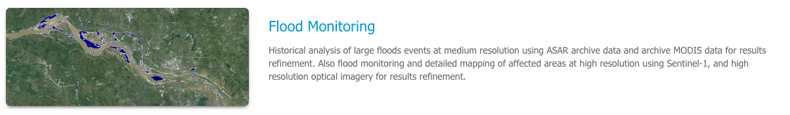
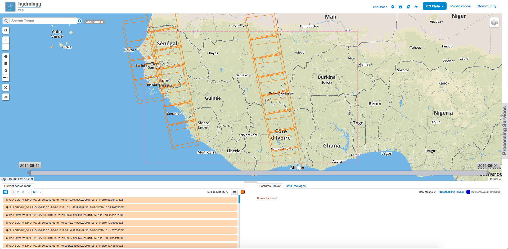
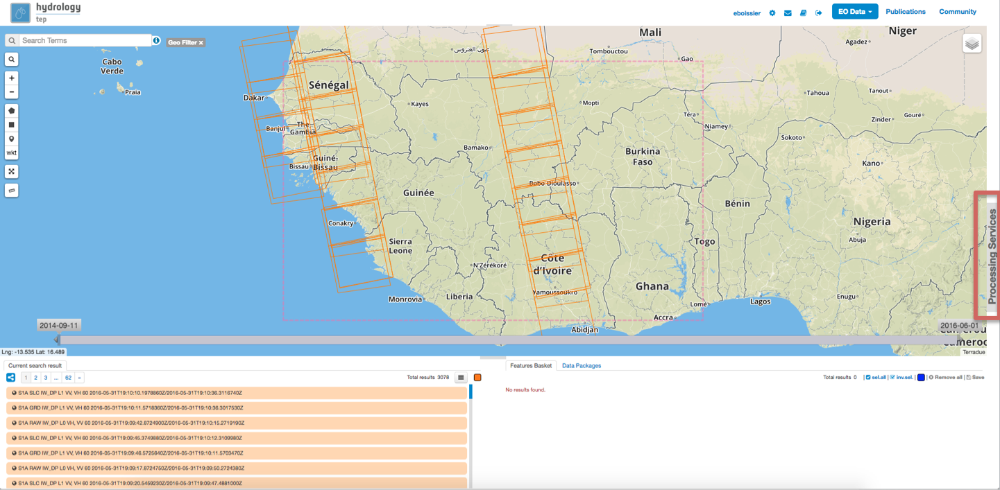
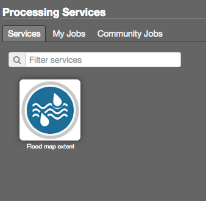
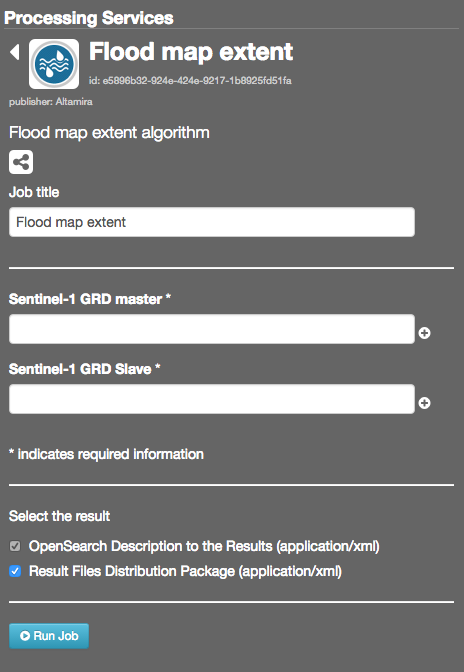

.. _app_niger_river:

Flood monitoring
================

Historical analysis of large floods events at medium resolution using ASAR archive data and archive MODIS data for results refinement. Also flood monitoring and detailed mapping of affected areas at high resolution using Sentinel-1, and high resolution optical imagery for results refinement.

Access to the thematic application
----------------------------------

From the thematic application page, click on the **Flood monitoring** application.

A new page with the geobrowser, data collections and processing services associated to the Flood monitoring application will appear.

Run the flood map extent processing service
-------------------------------------------

Open the Processing Services tab on the right of the geobrowser.

Select the **Flood map extent** service.

Select data from the search result panel, or from a data package, and drag and drop the selected data into the **Sentinel-1 GRD master** and **Sentinel-1 GRD slave** input.
As an example, you can find suitable data in the data package named **Flood mapping tutorial** (see how to select a data package).

Then click on the **Run job** button.

