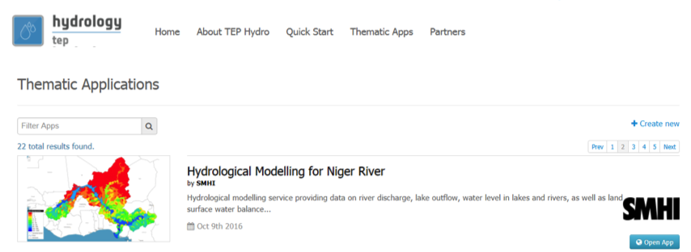
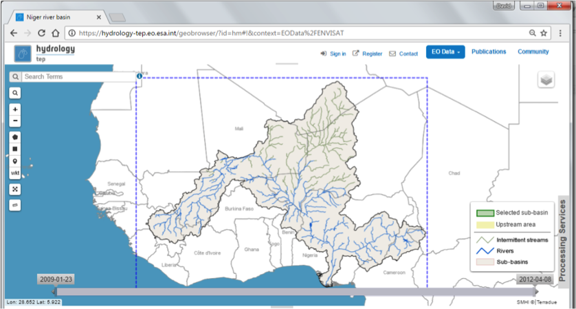
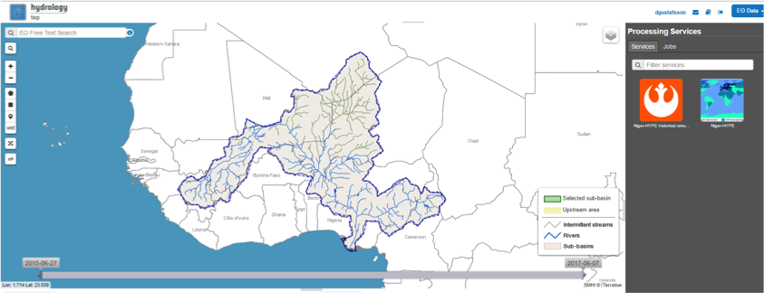
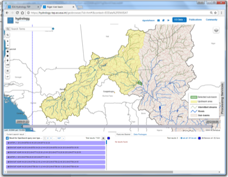
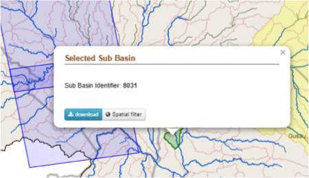
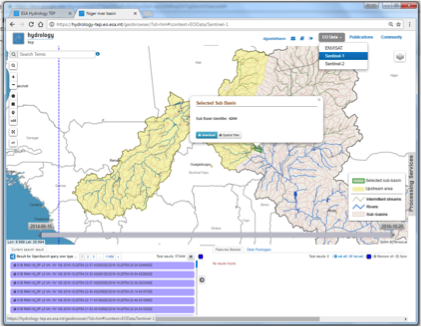

.. _hm:

Hydrological Modelling
======================

The aim of the Hydrological Modelling Application is to provide a platform for assimilation of EO data in hydrological models. It includes processing services for running a hydrological model in hindcast and forecast mode with or without data assimilation, accessing meteorological data from external data services, preparing EO data for assimilation in the hydrological models, basic visualization and statistical analysis of model results.
 
The Hydrological Modelling Application is implemented using the Niger-HYPE model (v2.1) providing simulations of river discharge, lake water level and outflow, as well as land surface water balance components (precipitation, evapotranspiration, soil water content) for the Niger river basin. The service collects meteorological forcing data from the SMHI Global Forcing Data service for simulations of historical periods from 1979 until current time, and short to medium range forecasts (10 days) since 2016-06-01. The following four Processing services are included in the application:

- Niger-Hype simulation of historical period
- Niger-HYPE forecast
- EO-data pre-processing
- Return Period magnitude Analysis
 
Further details about the Niger-HYPE model `http://hypeweb.smhi.se/niger-hype <http://hypeweb.smhi.se/niger-hype>`_.
Source code and information about the HYPE model see `http://hypecode.smhi.se <http://hypecode.smhi.se>`_.
Documentation and wiki about HYPE that can be useful in the following hands on exercises is found here `http://www.smhi.net/hype/wiki/doku.php <http://www.smhi.net/hype/wiki/doku.php>`_.

Access to the thematic application
----------------------------------

The Hydrological Modelling application is accessed from the home page of the Hydrology TEP community portal:
 
1. Enter the **HEP portal** and **sign** in with your HEP community user account `https://hydrology-tep.eo.esa.int <https://hydrology-tep.eo.esa.int>`_
2. Open the list of **Thematic applications** with the `view_apps <https://hydrology-tep.eo.esa.int/#!thematic>`_ link below the Discover Thematic Apps icon. 
3. Switch to the **second tab** to find the link to the `Hydrological_modelling <https://hydrology-tep.eo.esa.int/geobrowser/?id=hydrologicalmodelling>`_ application (Open App):

4. The initial view of the hydrological modelling application showing the Niger-River drainage basin in the Geobrowser as represented in the Niger-HYPE[1]_ model.

5. Selection of area of interest based on drainage basins and upstream area:
	
	a. Integrated in the Geobrowser is a functionality to select of area of interest for EO data exploitation based on the hydrological model sub-basins and their upstream area

6. Hydrological Modelling Processing Services are found on the Processing  Services tab on the right side of the geobrowser: 
	
	a. Niger-Hype simulation of historical period
	b. Niger-HYPE forecast
	c. EO-data pre-processing
	d. Return Period magnitude Analysis

 
Instructions how to run the different processing services are given in the following sections.

Selecting the Area of Interest based on drainage basins and upstream area
-------------------------------------------------------------------------

The hydrological model sub-basin layer makes it possible to select area of interest based on drainage basins and upstream area.
 
This functionality is dependent on the drainage basin data set available on the portal.
 
Currently, the drainage basin of the Niger river as represented in the Niger-HYPE model is the only dataset loaded into the HEP community portal. 

Select a sub-basin and it’s upstream area in the Geobrowser
~~~~~~~~~~~~~~~~~~~~~~~~~~~~~~~~~~~~~~~~~~~~~~~~~~~~~~~~~~~

1. Zoom in to the area of interest and select a sub-basin by clicking in the map (left mouse button[2]_). The selected sub-basin is highlighted in green, and the upstream areas in yellow.
2. To select another sub-basin, click in another non-highlighted basin (it’s not possible to select a sub-basin from the current selected upstream area).

3. Click a second time in the selected sub-basin and a pop-up dialogue will appear with information about the sub-basins identifier in the Niger-HYPE model. There is also functionality for applying spatial filter on the EO data selection, see further below. 

4. Known issues

	a. It is not possible to select sub-basins that are covered by an EO data coverage polygon. Try to reduce the EO data selection by changing data set or by using the time filter. 
	b. To select a sub-basin in the current selected upstream area, the selected region must first be de-selected, which can done by selecting a non-highlighted sub-basin in another part of the model domain.

Spatial filtering of EO data using the hydrological model sub-basins
~~~~~~~~~~~~~~~~~~~~~~~~~~~~~~~~~~~~~~~~~~~~~~~~~~~~~~~~~~~~~~~~~~~~

1. Select the sub-basin of interest by mouse click in the geobrowser.
2. Select the EO data of interest from the EO data drop-down menu at the top-right of the portal.
3. Click a second time in the sub-basin of interest, and apply the spatial filter in the pop-up dialogue

The method will select the EO data that are covering the selected sub-basin only.
 
By clicking somewhere in the upstream area, the spatial filter will be applied using the upstream area.
 
The selected data sets can be added to the Feature basket and used for processing within the other thematic applications.

Run the Niger-HYPE Simulation of historical period Service
----------------------------------------------------------

To be updated based with similar content as in the Quick start guide for the updated service.

Run the Niger-HYPE Forecast Processing Service
----------------------------------------------

To be updated based with similar content as in the Quick start guide for the updated service.

Run the EO Data Pre-processing Processing Service
-------------------------------------------------

To be updated based with similar content as in the Quick start guide for the updated service.

Run the Return Period Magnitude Analysis Processing service
-----------------------------------------------------------

To be updated based with similar content as in the Quick start guide for the updated service.

.. [1]  See `http://hypecode.smhi.se <http://hypecode.smhi.se>`_ and `http://hypeweb.smhi.se/nigerhype <http://hypeweb.smhi.se/nigerhype>`_ for more details about the hydrological model HYPE and the Niger-River HYPE model application, respectively. 
.. [2] The EO data coverage polygons may be blocking the sub-basin polygons. Solution, see *Known issues*.
