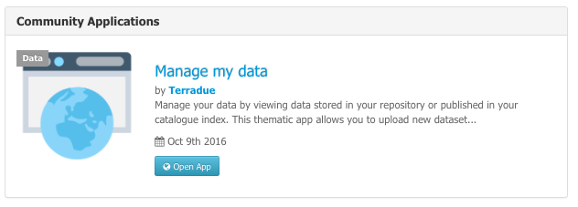

Manage my data
--------------

Each starter user has a personal app in which he can access:

- his private catalog index - using the **My Index** context,
- his private storage - using the **My Repository** context,
- data packages,
- a service to upload local data into his private storage,
- a service to publish data results as atom feeds to the catalogue,
- a service to contextualize on-demand results files

Data Upload
~~~~~~~~~~~

Allow the user to drag and drop local files and upload them to his private store repository (or to any accessible repository, using custom path eventually).

- Click on |storeupload|
- Select a **Target Repository** and a **Target Path**
- Drag and drop files
- Click on **Submit Upload**
- Wait for upload to finish

Data Publication
~~~~~~~~~~~~~~~~

This process publish data on the catalogue. It performs a query for every opensearch reference set in input and publish it in the catalogue index specified. At the end of the process, a reference to the catalogue index for viewing the results is returned.

- Open the service **Data Publication** in the WPS Service tab
- Select the context **My Repository**
- Drag and drop items from the search result tab into the field **Data items**
- Set Terradue **Username** and Terradue **Apikey**
- Set the **Index** (if not your private one)
- Click on **Run job**
- Select the context **My Index**, the published items are available in the search result

Data Contextualization
~~~~~~~~~~~~~~~~~~~~~~

.. figure:: ../includes/apps_mydata_datacontext.png
	:figclass: img-border
	:scale: 80%

This process contextualize data. It performs a geospatial analysis of the files in a specific repository for a given directory of the Data Gateway. At the end of the process, an OWS context with all the possible offerings of the analyzed files is returned.

- Open the service **Data Publication** in the WPS Service tab
- Select the **Folder path** (path under https://store.terradue.com)
- Set Terradue **Username** and Terradue **Apikey**
- Set the **Repository key**
- Set other options if necessary
- Click on **Run job**