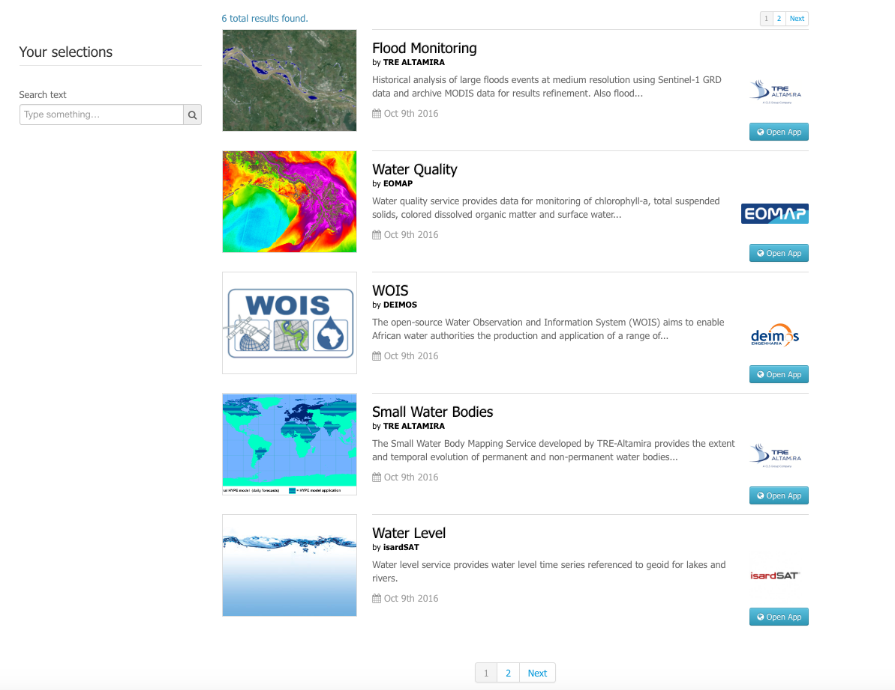

Overview
========

A *Thematic App* is a specific version of the geobrowser, in which specific parameters are pre-defined, in order to serve a specific thematic.
It is defined by a list of services offerings, such as:

	- web widget,
	- map layer,
	- map background,
	- data series,
	- wps services

.. req:: HEP-TS-DES-002
	:show:

	This section describes how a user can create its own thematic application.

.. req:: HEP-TS-DES-002
	:show:

	This section describes the data flow of thematic apps.

A list of pre-defined thematic apps can be accessed from the *Thematics* page.

The pre-defined thematics are:

	- Niger river (see :ref:`app_niger_river`),
	- Red river (see :ref:`app_red_river`),
	- Global Hydrological Modeling (see :ref:`app_hydro_model`),
	- WOIS CloudToolbox (see :ref:`app_wois`)

All users also have an application dedicated to the management of all items he owns (see :ref:`app_workspace`).
It is call **My worskpace** and will give to the user the ability to manage (edit / share / delete) all items he owns amongst WPS services, data collections, data packages, WPS jobs.

From this "workspace", users can also manage (create / edit / delete) their own *Thematic App* (see :ref:`app_workspace`).

