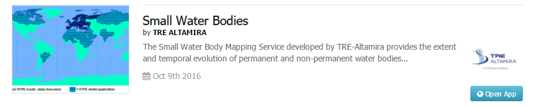
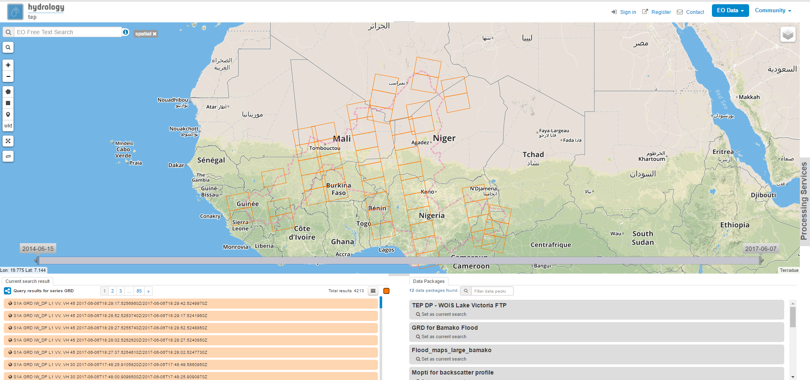
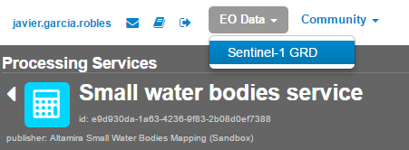
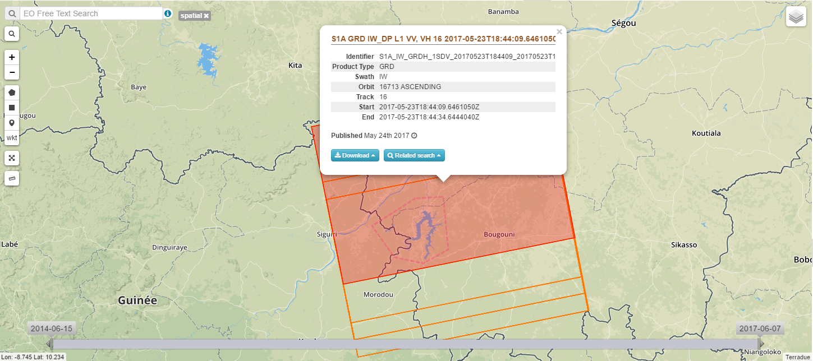
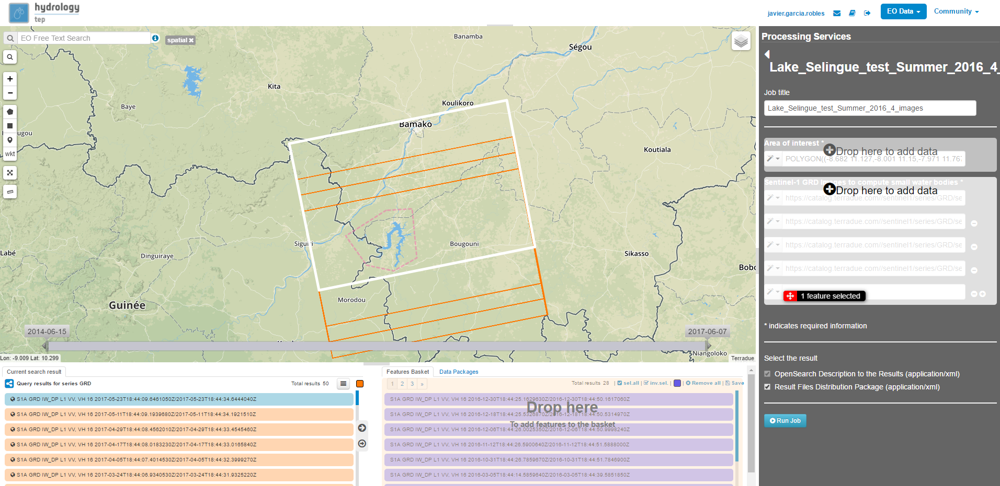
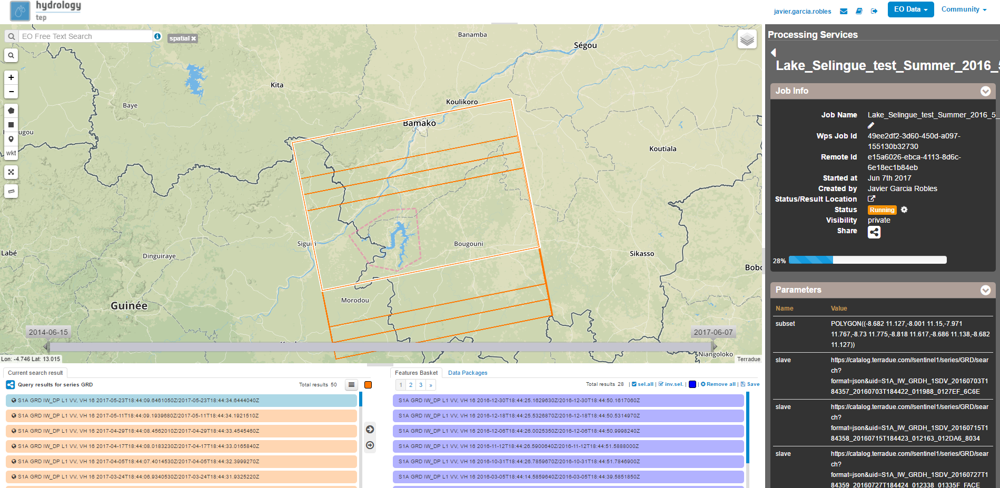
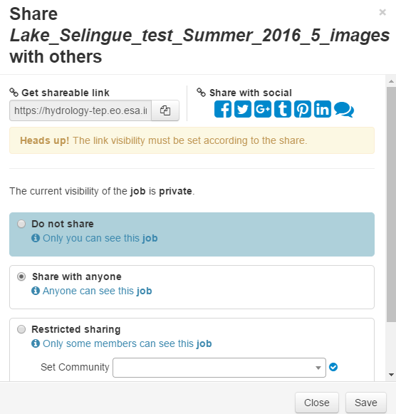

.. _swbm:

Small Water Body Mapping
========================

The Small Water Body Mapping Service provides the extent and temporal evolution of permanent and non-permanent water bodies providing it into detailed mapping, Time Series and water bodies surface evolution in time. The service is based on Sentinel 1 SAR acquisitions and ASAR for historical analysis as well as the possibility of results refinement using Sentinel-2 Optical Data. 

Access to the thematic application
----------------------------------

From the thematic application page, click on the **Open App** button for the **Small Water Body Mapping** application.

A new page with the geobrowser, data collections and processing services associated to the Small Water Body Mapping application will appear.

Open the 'Processing Services' section by clicking on **Processing Services** on the right-hand side of the geobrowser window:

.. figure:: ../includes/apps_wq_geobrowser2.png
	:figclass: img-border
	:align: center
	:scale: 100%

Within the 'Processing Services' section you will find the Small Water Body Mapping Service in the 'Services' tab, click on the Icon to open the service:

.. image:: ../includes/apps_swbm_3.png
	:width: 45%
.. image:: ../includes/apps_swbm_4.png
	:width: 45%

Select what kind of **EO Data** data you would like to process using the dropdown menu on the top right, so far the Small Water Body Mapping Service only supports Sentinel-1 data.

Zoom to your region of interest and use the **spatial filter** to spatially restrict the list of scenes: Click on the spatial filter symbol (little square) or on the polygon symbol on the left-hand side of the geobrowser and draw a polygon on the map. 

.. image:: ../includes/apps_wq_spatialfilter1.png
	:width: 14%
.. image:: ../includes/apps_swbm_6.png
	:width: 84%

Use the **temporal filter** via the time slider at the bottom of the map to restrict the list of scenes temporally:

.. figure:: ../includes/apps_wq_timefilter.png
	:figclass: img-border
	:align: center
	:scale: 100%

By clicking on the image in the geobrowser further information is visible such as Identifier, product type, swath, orbit and geometry, track, start and end time of acquisition. Images can be downloaded from the platform clicking the Download button.

Check that all the images that you plan to process entirely cover the former drawn AOI. The wide white square delimitates the frame of the image whilst other images available appear in thiner red frames.

.. figure:: ../includes/apps_swbm_8.png
	:figclass: img-border
	:align: center
	:scale: 100%

The list of available scenes is now filtered for your needs. If you identified a scene you would like to process you can add the scene via drag&drop from the scene list on the bottom left to the Small Water Body Service (right part of the browser):

In order to process this service you need at least two images to compute statistics between the water detected bodies. Drag two or more images on the **Sentinel-1 GRD images** squares. Then select a **title** for your processing job, e.g. "Lake_Selingue_test_Summer_2016_5_images"

.. figure:: ../includes/apps_swbm_10.png
	:figclass: img-border
	:align: center
	:scale: 90%

Now you can **either** click on the **Run Job** button

**OR** you could add more scenes to your job, from the same EO Data collection or you can even add scenes from another collection.
Therefore just change the **EO Data** collection in the dropdown menu on the top right.

If your are satisfied with your scenes and settings click on the **Run Job** button to start the processing.

You can make accessible your processing results to other users. To do it click at the share button and select the more suitable option for you: Do not Share / Share with anyone / Restricted sharing to some members.

Check that now the results are tagged as public in the geobrowser. Any user in the platform will have access to your processed job and will see either its status and results when it finishes.

.. figure:: ../includes/apps_swbm_13.png
	:figclass: img-border
	:align: center
	:scale: 90%

