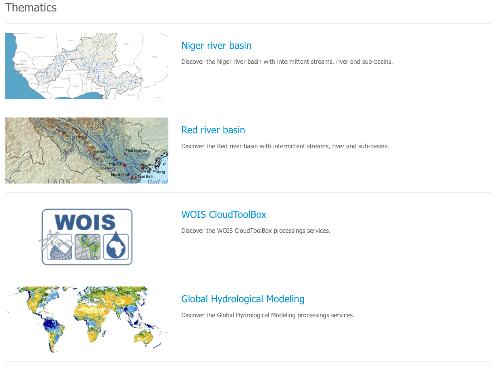

Thematic Apps
=============

A *Thematic App* is a specific version of the geobrowser, in which specific parameters are pre-defined, in order to serve a specific thematic.
It is defined by a list of services offerings, such as:

	- web widget,
	- map layer,
	- map background,
	- data series,
	- wps services
	- ...

.. req:: HEP-TS-DES-002
	:show:

	This section describes how a user can create its own thematic application.

.. req:: HEP-TS-DES-020
	:show:

	This section describes the data flow of thematic apps.

Pre-defined apps
----------------

A list of pre-defined thematic apps can be accessed from the *Thematics* page.

The pre-defined thematics are:

User's apps
-----------

A user is able to define its own *Thematic App* by selecting widget amongst:

- Dataset search widget defining series, collection or data packages OpenSearch endpoint
- processing Service widget defining service series OpenSearch endpoint
- Map description (background, layers)
- Data package widget defining the data packages OpenSearch endpoint
The application shall be defined using OGC OWS Context.

.. req:: HEP-TS-FUN-015
	:show:

	This section describes how a user can create its own thematic application.
