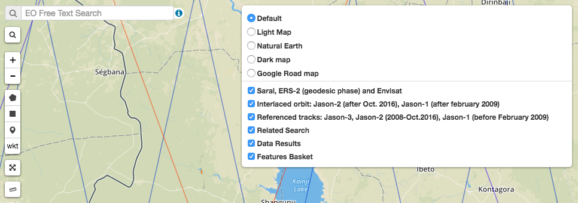
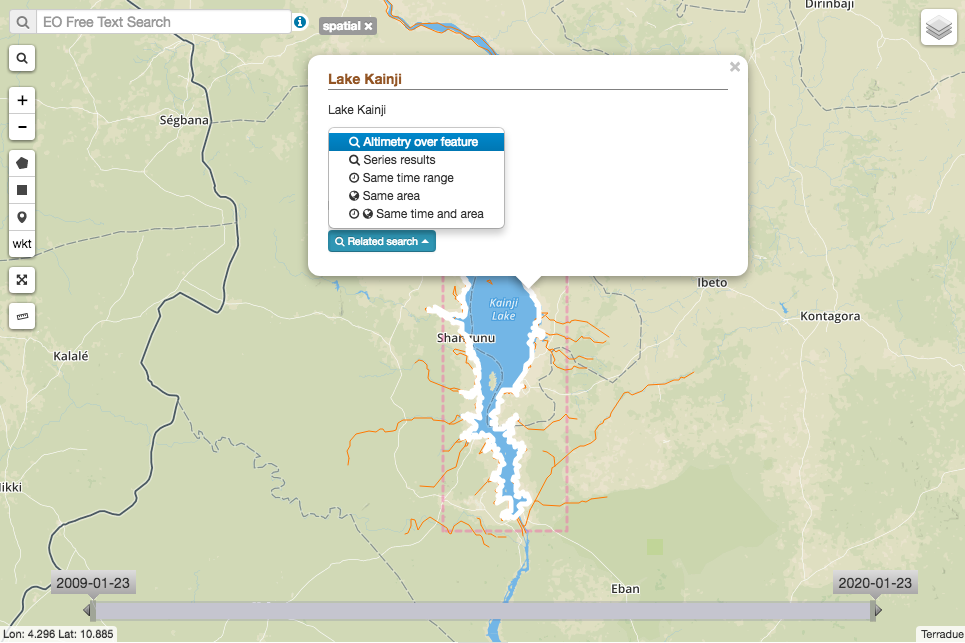
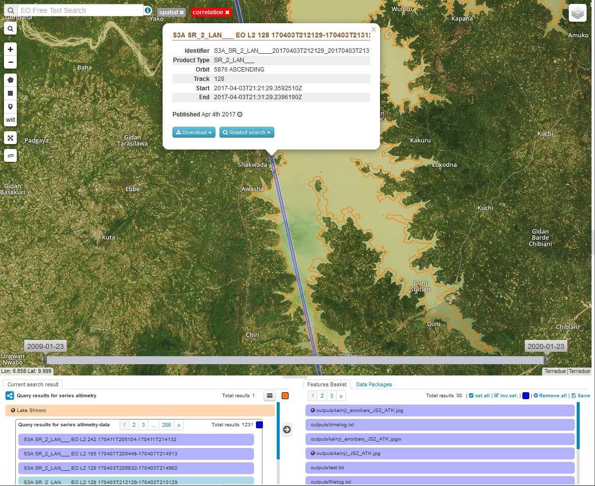
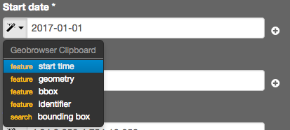
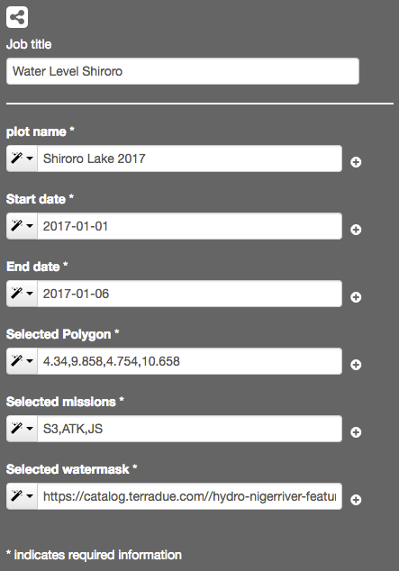

.. _wl:

Water Level
===========

Water Level services provide water level time series based on Altimetry for lakes and rivers.

.. raw:: html

   <iframe width="560" height="315" src="https://www.youtube.com/embed/hbD_-9Nc698" frameborder="0" allow="accelerometer; autoplay; clipboard-write; encrypted-media; gyroscope; picture-in-picture" allowfullscreen></iframe>

Water Level Access
------------------

From the thematic application page, click on the **Open App** button for the **Water Level** application.

A new page with the geobrowser, data collections and processing services associated to the Water Level application will appear.

View Altimetry tracks on the Geobrowser
---------------------------------------

Optionally, nominal tracks from Jason, Altika, and Sentinel-3 can be activated as layers, in order to perform a visual inspection of the water bodies that are crossed by tracks, in other words, where altimetric measurements could be retrieved from satellite data. 

To discover the actual tracks from each mission, that cross a specific water body during a certain period of time, define an area of interest with the spatial filter tool.

Click on the water body, in the Related search menu, select 'Altimetry over feature'

Execute the water level service
-------------------------------

In the geobrowser, define your area of interest drawing a rectangle with the spatial filter tool, click on the water body and select 'Altimetry over feature' from the Related search menu. Apply your desired temporal filter using the time bar. Resulting tracks and existing water bodies will be displayed in the query results (paginated).

Open the 'Processing Services' section by clicking on **Processing Services** on the right-hand side of the geobrowser window, and click on the **Water Level** service.

Name your water level job as it will appear in your jobs list.

Name your plot as it will appear in the resulting time series plot from your job.

Select a start and an end date according to the temporal filter you are applying, you can either type the dates or use the magic buttons in the 
drop-down menu of each field, in order to use the Geobrowser Clipboard.

Insert your area of interest by selecting the bounding box option from the drop-down menu in the 'Selected Polygon' field.

Type your selected missions in the 'Selected missions' field: S3, ATK, JS. Use all as default if you do not have a preference for a specific mission.

In the geobrowser, select the water body of interest, you will identify it in the results list as it will be shown in blue, drag and drop the water body from the query results lists into the 'Selected watermask' field. More that one water mask can be processed within the same job, drag and drop all the water masks you wish to process.

Click on the 'Run job' button. Measurements for each water body will be generated as time series.

How to use pre-generated water masks from another service
---------------------------------------------------------

Water masks can be generated by different services, for example the Small Body Mapping service or WOIS. Save results as a data package.

In the Water level Processing Service, drag and drop the pre-generated water mask result into the 'Selected watermask field'.

Results
-------

Output files from the Water Level application can be visualised and downloaded. CSV output files contain time series of each successful job. TXT files contain a log about each job, including time performance, list of inputs and outputs, and the potential errors found.

