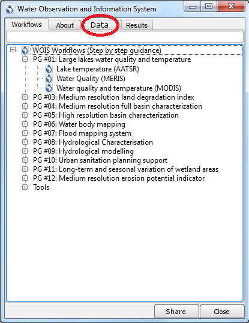
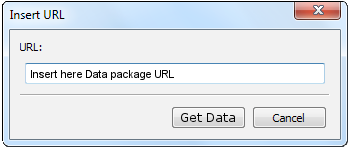
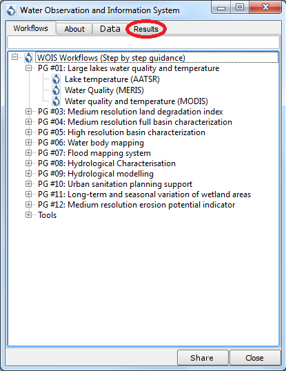
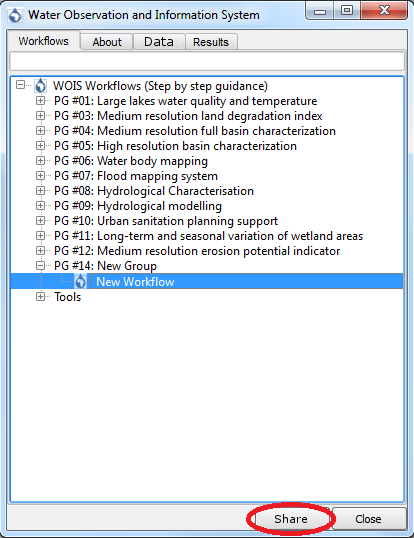

.. _app_wois:

WOIS CloudToolBox
=================

The WOIS CloudToolBox Thematic App focuses on the WOIS CloudToolBox processings.

.. figure:: ../includes/apps_wois.png
	:figclass: img-border
	:scale: 80%

WOIS Access
-----------

To access WOIS CloudToolBox through the Hydrology Exploitation Platform, the user has to sign-in using **EO-SSO**. To learn more about the User Profile and the sign-in operation please consult the section **"User Profile"** of this Documentation.

Select Data to use on WOIS
--------------------------

The Data Selection to use inside WOIS is also done within the Hydrology Exploitation Platform. To learn more about how to select Data and how to save Data as a package please consult the section **“Data”** of this Documentation.

After to save Data as a package, the user should have a URL, containing the datapackages information, which can paste inside QGIS in order to make the Data available on the Virtual Machine where WOIS is installed.

A QGIS plugin to get HEP Data on the VM was developed and the figure below explains how to open it.

.. figure:: ../includes/open_data_plugin.png
	:figclass: img-border
	:scale: 80%

Within HEP, WOIS is accessible through QGIS. The figure below explains how to open WOIS on QGIS.

.. figure:: ../includes/open_WOIS.png
	:figclass: img-border
	:scale: 80%

After open QGIS on the button

.. figure:: ../includes/WOIS_button.png
	:scale: 80%

A window with the default WOIS Workflows will open.

By clicking on the Tab “Data” (Red circle on the image above), a window will open and the user can paste the Data URL on it to get the Data selected before.

By clicking on the button “Get Data” all the Data into the package selected by the User will be available on the Virtual Machine where WOIS is running.

Run WOIS Workflow
-----------------

After open WOIS and get the Data, the user can finally run a WOIS Workflow. For that, the user shall select the intended workflow and double click as explained on the image below.

.. figure:: ../includes/WOIS_wf_select.png
	:figclass: img-border
	:scale: 80%

In this case, the workflow selected was the “Lake temperature (AATSR)”. A window with the first step of the workflow will open.

.. figure:: ../includes/WF_step_1.png
	:figclass: img-border
	:scale: 80%

On this window, the user will be able to open the data to process on this step, define parameters related with the operation and choose the output filepath. On the left side of the window, it is available a set of detailed explanations about the current step (input data, mean of each parameter and processing operation).
After set the parameters and the input and output data the user shall click the button “Run” in order to start the current step. On each step of the workflow, the user can go to a different step by using the buttons “< Previous step” and “Skip step >” and/or exit the workflow by clicking “Finish Workflow”.

Run Single Tool (WOIS as Modular Toolbox)
-----------------------------------------

Other option is to use WOIS as a modular toolbox. Inside QGIS, the user has available all the tools that can be used on WOIS workflows and can use them to perform single operations. The figure below shows all the available toolboxes and libraries.

.. figure:: ../includes/WOIS_modular_tbx.png
	:figclass: img-border
	:scale: 80%

On the figure below, a tool from the Sentinel-1 Toolbox was selected (Range Doppler Terrain Correction).

.. figure:: ../includes/WOIS_modular_tbx_single_tool_selection.png
	:figclass: img-border
	:scale: 80%

A window will open and will allow the user to select the input data to process the operation, define the operation parameters and choose the output filepath.

.. figure:: ../includes/WOIS_modular_tbx_single_tool_interface.png
	:figclass: img-border
	:scale: 80%

After set the parameters to perform the single operation, the user can start it by clicking the button “Run”.

Share Outputs
-------------

A WOIS user can share his outputs with the HEP Community. To do that, on the WOIS Workflows window the user shall select the Tab “Results”.

The Tab “Results” will display the list of all the outputs generated by the workflows run by the user will appear. Here, the user can select the results which intend to share.

.. figure:: ../includes/WOIS_share_results.png
	:figclass: img-border
	:scale: 80%

Create Workflow
---------------

Other feature available in WOIS is to create new workflows.

.. figure:: ../includes/WOIS_create_new_WF_selection.png
	:figclass: img-border
	:scale: 80%

Inside WOIS Tools, the user shall select the option “Create new workflow”.
The interface to create a new workflow is displayed on the figure below.

.. figure:: ../includes/WOIS_create_new_WF.png
	:figclass: img-border
	:scale: 80%

The first thing to do is to choose the “Workflow Name” and the “Group” of the new workflow (top of the window). This information will appear later on the WOIS Workflows Window, with all the default workflows.
On the left side, the user can select the tool or operation which intends to perform on each step. After that, on the left side, the operation window will appear (equal to the window that will open when the user decide to run the workflow later).

.. figure:: ../includes/WOIS_create_new_WF_step_definition.png
	:figclass: img-border
	:scale: 80%

Here, the user will be able to set the default parameters and write the explanations that are considered important to pass to whoever runs the workflow. Other option to define on each workflow step is the “Input Data Mode”. The options are “Normal” or “Batch” (single input or multiple inputs, respectively).
After set up everything, the user will be able to test the step created, by click the button "Test", or simply save it and configure the next steps until get a complete workflow.

Share Workflow
--------------

After create a New Workflow, the user has the possibility of share it with the HEP Community. For that, on the WOIS Workflows window, the user shall select the New Workflow created and click the button “Share” as explained on the image below.

**Note:** A new workflow created can also be inserted into existent Groups. To do that, the user shall use an existent “Group” name when creates the workflow.
