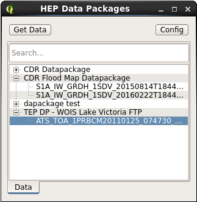
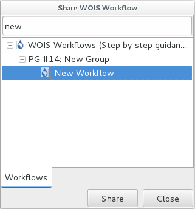

.. _app_wois:

WOIS CloudToolBox
=================

The WOIS CloudToolBox Thematic App focuses on the WOIS CloudToolBox processings.

.. figure:: ../includes/apps_wois.png
	:figclass: img-border
	:scale: 80%

WOIS Access
-----------

To access WOIS CloudToolBox through the Hydrology Exploitation Platform, the user has to sign-in using **EO-SSO**. To learn more about the User Profile and the sign-in operation please consult the section **“User Profile”** of this Documentation. WOIS VMs are accessible via VNC.

To create a new WOIS VM, the user should access to https://cloud.terradue.com/ and create a new VM using the WOIS VM template available (only avalable for some users).

To access the VM via VNC, the user can use a VNC client (e.g. VNC Viewer) or select the new VM in https://cloud.terradue.com/ and click the button

If the user uses a VNC client, the VNC server for the VM is **IP:5902**

QGIS configuration (first access)
---------------------------------

- Plugins -> Installed -> Select the following plugins:

	HEP Plugin
	
	Processing BEAM and SNAP algorithm provider
	
	Processing Workflows
	
	Temporal/Spectral Profile Tool
	
	Value Tool
	
	Zonal statistics plugin

- Processing -> Toolbox (this is to activate the toolbox)

- Processing -> Options -> Providers:

	BEAM:
	   Activate
	   
	   BEAM install directory: /opt/beam-5.0 (click Enter)

	Processing Workflows (Step by step guidance):
	   Activate
	   
	   Activate WOIS toolbox collection

	R scripts
	   Activate

	SNAP Toolbox (Sentinel Application Platform)
	   Activate
	   
	   Activate Sentinel-1 toolbox (same for sentinel-2, 3)
	   
	   SNAP install directory: /opt/snap-5.0 (click Enter)

	Orfeo Toolbox (Image analysis)
	   Activate
	   
	   OTB application folder: /opt/OTB-5.0.0/lib/otb/applications
	   
	   OTB command line tools folder: /opt/OTB-5.0.0/bin

	**Note:** If the OTB version installed is higher than 6.0.0 downgrade it to the 5.0.0 (sudo yum downgrade OTB)

- Restart QGIS and the HEP Plugin button, WOIS button and all the required plugins will be available.

Select Data to use on WOIS
--------------------------

The Data Selection to use inside WOIS is also done within the Hydrology Exploitation Platform. To learn more about how to select Data and how to save Data as a package please consult the section **“Data”** of this Documentation.

After to save Data as a package, the user should have an API Key, which can paste inside HEP Plugin in order to make his Data available on the Virtual Machine where WOIS is installed.

A QGIS plugin (HEP Plugin) was developed and the figure below explains how to open it.

.. figure:: ../includes/open_data_plugin.png
	:figclass: img-border
	:scale: 80%

After open QGIS, click on the button.

.. figure:: ../includes/hep_data_button.png
	:scale: 80%

The HEP Plugin window will pop up.

.. figure:: ../includes/HEP_plugin_5.png
	:figclass: img-border
	:scale: 80%

Click the button "Get Data from TEP".
If it's the first time the user uses this feature, a window, where the user can change the datapackages URL or insert his API Key (to access to his datapackages), will pop up. To learn how to get your API Key please consult the subsection **“Get your Api key”** inside the **“User Profile”** section.

If the user already entered the API Key before, a new window listing all the datapackages owned by that user and the products inside each package will pop up automatically.

By double clicking on a product or by selecting a product and clicking “Get Data”, a window to select the location to save will open. After choose the location the product will be downloaded. If a product is not on cache, the user will be advertised to download the product later.
By clicking on the button "Config", the user is able to update the datapackages URL or insert other API Key to get different datapackages.

Run WOIS Workflow
-----------------

WOIS is accessible through QGIS. The figure below explains how to open WOIS on QGIS.

.. figure:: ../includes/open_WOIS.png
	:figclass: img-border
	:scale: 80%

After open QGIS, click on the button.

.. figure:: ../includes/WOIS_button.png
	:scale: 80%
	
After open WOIS and get the Data, the user can finally run a WOIS Workflow. For that, the user shall select the intended workflow and double click as explained on the image below.

.. figure:: ../includes/WOIS_wf_select.png
	:figclass: img-border
	:scale: 80%

In this case, the workflow selected was the “Lake temperature (AATSR)”. A window with the first step of the workflow will open.

.. figure:: ../includes/WF_step_1.png
	:figclass: img-border
	:scale: 80%

On this window, the user will be able to open the data to process on this step, define parameters related with the operation and choose the output filepath. On the left side of the window, it is available a set of detailed explanations about the current step (input data, mean of each parameter and processing operation).
After set the parameters and the input and output data the user shall click the button “Run” in order to start the current step. On each step of the workflow, the user can go to a different step by using the buttons “< Previous step” and “Skip step >” and/or exit the workflow by clicking “Finish Workflow”.

Run Single Tool (WOIS as Modular Toolbox)
-----------------------------------------

Other option is to use WOIS as a modular toolbox. Inside QGIS, the user has available all the tools that can be used on WOIS workflows and can use them to perform single operations. The figure below shows all the available toolboxes and libraries.

.. figure:: ../includes/WOIS_modular_tbx.png
	:figclass: img-border
	:scale: 80%

On the figure below, a tool from the Sentinel-1 Toolbox was selected (Range Doppler Terrain Correction).

.. figure:: ../includes/WOIS_modular_tbx_single_tool_selection.png
	:figclass: img-border
	:scale: 80%

A window will open and will allow the user to select the input data to process the operation, define the operation parameters and choose the output filepath.

.. figure:: ../includes/WOIS_modular_tbx_single_tool_interface.png
	:figclass: img-border
	:scale: 80%

After set the parameters to perform the single operation, the user can start it by clicking the button “Run”.

Upload Outputs to HEP
---------------------

After a workflow run, a user can upload the results to his HEP Data Storage. This will allow the user to check the results on the HEP Webportal or share his outputs with the HEP Community.

A QGIS Script to upload results to HEP ("Upload to TEP") was developed and it can be used in two different ways:

**1) Directly on QGIS (VM)**

Click on the button to open the HEP Plugin.

.. figure:: ../includes/hep_data_button.png
	:scale: 80%

The HEP Plugin window will pop up.

.. figure:: ../includes/HEP_plugin_5.png
	:figclass: img-border
	:scale: 80%
	
By clicking the button "Upload Data to TEP" (image above), the following window will pop up.
	

	
Insert the storage/catalog username and password (mandatory). The “remote directory” is optional and its function is to organize different outputs uploaded.
This tool allows to upload raster and vector outputs to TEP. For the raster data (compatible with QGIS), it is also possible to generate a Quicklook (png) to display over the map. If the raster is too big, the Quicklook won't be generated since the QGIS has pixel limit to create images from layers.

**Note:** Only a raster or a vector file must be selected each time (not both).

**2) Include the script as the final step of a workflow**

.. figure:: ../includes/upload_outputs_on_wf.png
	:figclass: img-border
	:scale: 80%
	
Storage/catalog username and password are not necessary in this case.

When an output is exported to HEP, it will appear at the HEP Webportal, as it is shown on the image below (only png files are displayed but all the uploaded outputs can be downloaded).

.. figure:: ../includes/outputs_on_hep.png
	:figclass: img-border
	:scale: 80%

Create Workflow
---------------

Other feature available in WOIS is to create new workflows.

.. figure:: ../includes/WOIS_create_new_WF_selection.png
	:figclass: img-border
	:scale: 80%

Inside WOIS Tools, the user shall select the option “Create new workflow”.
The interface to create a new workflow is displayed on the figure below.

.. figure:: ../includes/WOIS_create_new_WF.png
	:figclass: img-border
	:scale: 80%

The first thing to do is to choose the “Workflow Name” and the “Group” of the new workflow (top of the window). This information will appear later on the WOIS Workflows Window, with all the default workflows.
On the left side, the user can select the tool or operation which intends to perform on each step. After that, on the right side, the operation window will appear (equal to the window that will open when the user decide to run the workflow later).

.. figure:: ../includes/WOIS_create_new_WF_step_definition.png
	:figclass: img-border
	:scale: 80%

Here, the user will be able to set the default parameters and write the explanations that are considered important to pass to whoever runs the workflow. Other option to define on each workflow step is the “Input Data Mode”. The options are “Normal” or “Batch” (single input or multiple inputs, respectively).
After set up everything, the user will be able to test the step created, by click the button "Test", or simply save it and configure the next steps until get a complete workflow.

**Note:** A new workflow created can also be inserted into existent Groups. To do that, the user shall use an existent “Group” name when creates the workflow.

Share Workflows
---------------

After create a new Workflow, the user has the possibility of share it with the HEP Community. For that, the user shall select the WOIS tool "Share WOIS workflow" on the HEP Plugin.

Click on the button to open the HEP Plugin.

.. figure:: ../includes/hep_data_button.png
	:scale: 80%

The HEP Plugin window will pop up.

.. figure:: ../includes/HEP_plugin_5.png
	:figclass: img-border
	:scale: 80%

By clicking the button "Share WOIS workflow", the interface to share a workflow will pop up (figure below).

On this window, the user shall select the new Workflow created and click the button “Share”.

Get Workflows from the shared repository
----------------------------------------

A user can also add the workflows shared by the community to his WOIS (on the VM). To do that, the user shall select the WOIS tool "Get WOIS workflow" on the HEP Plugin.

Click on the button to open the HEP Plugin.

.. figure:: ../includes/hep_data_button.png
	:scale: 80%

The HEP Plugin window will pop up.

.. figure:: ../includes/HEP_plugin_5.png
	:figclass: img-border
	:scale: 80%
	
By clicking the button "Get WOIS workflow", the interface to get a workflow will pop up (figure below).

.. figure:: ../includes/wf_get.png
	:figclass: img-border
	:scale: 80%

On this window, the user shall select the workflow to add and click the button “Get”.

QGIS Models
-----------

A QGIS model is a sequence of operations that run without interruptions. Each operation inside a QGIS model can be performed by the same third party libraries and tools that are used in WOIS workflows.

Create/configure QGIS models
----------------------------

Once the tools available to create QGIS models are the same available for WOIS, a user can create a model based on a WOIS workflow.
To create a new model, the user shall select the modeler tool "Create new model".

The interface to create a new model is displayed on the figure below.

	
The first thing to do is to choose the “Model Name” and the “Group” of the new model (top of the window).
On the left side, the user can select the tool or operation which intends to perform on each step. A schema with the model sequence will appearing on the right side.

It is also possible to upload the outputs of a model to HEP automatically, by including the script "Upload to TEP" as the final step of a model.

.. figure:: ../includes/create_model_w_upload.png
	:figclass: img-border
	:scale: 80%
	
**Note:** A new model created can also be inserted into existent Groups. To do that, the user shall use an existent “Group” name when creates the model.
	
Export QGIS model to the HEP
----------------------------

**If the user creates the model on his local machine**, it will be possible to export the created model to the VM owned by the user, to make the it available in the H-TEP portal.
To export a model, the user shall select the modeler tool "Export model to TEP", available with the lite version of the HEP Plugin.

**Note 1:** The lite version of the “HEP Plugin” plugin shall be installed locally
**Note 2:** The plugin can be downloaded at https://github.com/hydrology-tep/hep-qgis-plugin-lite (installation and usage instructions in the README)

Click on the button to open the local HEP Plugin.

.. figure:: ../includes/hep_data_button.png
	:scale: 80%

The HEP Plugin window will pop up.

.. figure:: ../includes/Local_HEP_Plugin.png
	:figclass: img-border
	:scale: 80%

Click on the button "Export model to TEP" and the interface to export a model is displayed on the figure below.

.. figure:: ../includes/export_model_new_window.png
	:figclass: img-border
	:scale: 80%

On this window, the user shall select the model that intends to export, insert the VM IP, username and password. Then click the button "Export to TEP".

The exported model shall be automatically available on HEP Webportal.

**If the user creates the model inside the VM**, to export it to to the H-TEP portal, the procedure is:

Click on the button to open the local HEP Plugin.

.. figure:: ../includes/hep_data_button.png
	:scale: 80%

The HEP Plugin window will pop up.

.. figure:: ../includes/Local_HEP_Plugin.png
	:figclass: img-border
	:scale: 80%

Click on the button "Export model to TEP" and the interface to export a model is displayed on the figure below.

On this window, the user shall select the model that intends to export and click the button "Export to TEP". The IP, username and password are not required since the user is already inside the VM.

The exported model shall be automatically available on HEP Webportal.

Run QGIS model in HEP
---------------------

The user can run models, in the HEP Webportal, similar to other HEP services.
 
For that, the user must select the intended workflow as it is shown at the image below.
 
.. figure:: ../includes/select_model_hep.png
	:figclass: img-border
	:scale: 80%

Then, the user must enter the input parameters and click the button "Run Job" to start the model on the VM.

For each run, a folder is created to publish the outputs. The name of the folder is the job id.
