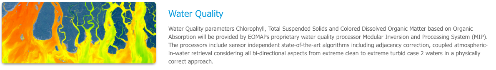

.. _wq:

Water Quality
=============

Water Quality parameters Chlorophyll, Total Suspended Solids and Colored Dissolved Organic Matter based on Organic Absorption will be provided by EOMAPs proprietary water quality processor Modular Inversion and Processing System (MIP). The processors include sensor independent state-of-the-art algorithms including adjacency correction, coupled atmospheric-in-water retrieval considering all bi-directional aspects from extreme clean to extreme turbid case 2 waters in a physically correct approach.

Access to the thematic application
----------------------------------

From the thematic application page, click on the **Water Quality** application.

A new page with the geobrowser, data collections and processing services associated to the Water Quality application will appear.

.. figure:: ../includes/apps_wq_geobrowser.png
	:figclass: img-border
	:scale: 80%

