.. _wq:

Water Quality
=============

Water Quality parameters *Chlorophyll*, *Total Suspended Solids* and *Colored Dissolved Organic Matter based on Organic Absorption* will be provided by `EOMAPs <http://www.eomap.com>`_ proprietary water quality processor Modular Inversion and Processing System (MIP). The processors include sensor independent state-of-the-art algorithms including adjacency correction, coupled atmospheric-in-water retrieval considering all bi-directional aspects from extreme clean to extreme turbid case 2 waters in a physically correct approach.   

Service Description
--------------------

+---------------------------+------------------------+----------------------------------------------------------------------------+
| **Service Inputs**        | Optical data:          |Sentinel2, Landsat8                                                         |
+---------------------------+------------------------+----------------------------------------------------------------------------+
| **Service Outputs**       | Water quality products:| - Chlorophyll-a (CHL)                                                      |
|                           |                        | - Colored Dissolved Organic Matter (CDOM)                                  |
|                           |                        | - Total Suspended Solids (TSS)                                             |
|                           |                        | - Sea Surface Temperature (SWT) - only Landsat8                            |
+---------------------------+------------------------+----------------------------------------------------------------------------+
|                           | Atmospheric correction:| Atmospheric corrected data (over water surfaces)                           |
+---------------------------+------------------------+----------------------------------------------------------------------------+
+ **Resolution of Outputs** | Sentinel 2:            | 10m                                                                        |
+---------------------------+------------------------+----------------------------------------------------------------------------+
|                           | Landsat 8:             | 30m                                                                        |
+---------------------------+------------------------+----------------------------------------------------------------------------+
+---------------------------+------------------------+----------------------------------------------------------------------------+

**Chlorophyll-a (CHL)** is one essential pigment included in phytoplankton cells and therefore a measure of phytoplankton. The seasonal development of the chlorophyll concentration is used for environmental monitoring, either on a daily basis or in form of statistical aggregations. It serves e.g. as an indicator for the eutrophication of a lake or water body. Further, algal blooms are monitored in their development, extent, and duration. As it is one of several absorbing components in the water column, Chlorophyll pigments are identified by typical spectral absorption maxima in the blue and red region and thus reducing the reflected sun light in the respective wavelengths, which enables the assessment of CHL in satellite data. The EOMAP processor produces harmonized, standardised, Chlorophyll-a products in [μg/l] for a range of sensors. It is based on the derived information of in-water organic absorption, in-water turbidity and spectral characteristics of each water body. Fractions in the total absorption including inorganic absorbers as well as other absorbing pigments (e.g. humic substances) are considered the calculation in order to extract Chlorophyll-concentrations.

**Colored Dissolved Organic Matter (CDOM)** in [1/m] comprises all dissolved organic matter, which influences the water colour, mainly consisting of humic and fulvic acids. It can be used as proxy for the carbon content of a water body .CDOM is measured in terms of absorption at a specific reference wavelength, which is here defined at 440nm. 

**Total Suspended Solids (TSS)** is a key parameter of water quality and is linearly related to the backward scattering of light of organic and inorganic particles in water. High concentrations of particles affect for example the light penetration, influences habitat quality for fishes or other aquatic life and can provide attachment possibilities for pollutants such as bacteria or heavy metals. The measurement unit is mg/l or g/m³. Total Suspended Solids concentrations are determined by the backward scattering of light between 450 to 800nm, physically retrieved using satellite data with a 1:1 relation of the primarily retrieved turbidity and suspended solids concentrations. The linear relation between turbidity and suspended matter/solids in low to moderate concentrations is in most cases regional constant, but can vary with particle size distribution. A regional calibration may further assure the accuracy for high concentrations.

**Surface Water Temperature (SWT)** in [degree Celsius] is calculated from thermal infrared channels recorded by optical satellites. It measures the top skin temperature of the water body, which might represents also epilimnic temperature.

**Atmospheric corrected product** consists of satellite imagery which has been corrected for the effects of the atmosphere and scattering light from adjacent land and water surfaces. It provides reflectance data instead of scaled radiances or top-of-the atmosphere products and improves satellite imagery by minizing effects of haze and atmospheric aerosols. Reflectance will be delivered as Remote Sensing Reflectance above surface at nadir (Rrs0+).

**Background on Satellite Data**

Multispectral satellite sensors like MSI on Sentinel -2 or OLI on Landsat 8 measure reflected sunlight, which is modified on its way through the atmosphere and the water column. The quality of the data can be influenced by different factors. For example, due to the passive nature of this remote sensing method no signal from the water body can be derived under clouds. Also, cloud shadows can lead to a typically underestimation of the retrieved water quality parameter concentrations. High concentration of aerosols and resulting scattering or cirrus clouds can further hinder a successful retrieval. In addition, particular geometrical conditions between sun, target and sensor in combination with specific sea-state-conditions (wind speed, direction) can result in signal distorting mirroring effects, called sun glint, on the water surface. In areas with optically shallow water, where signals from the seafloor influences the signal received at the sensor, the concentrations can be overestimated. When choosing a scene to be processed, especially cloud coverage and sunglint conditions need to be considered.

Access to the thematic application
----------------------------------

From the thematic application page, click on the **Open App** button for the **Water Quality** application.

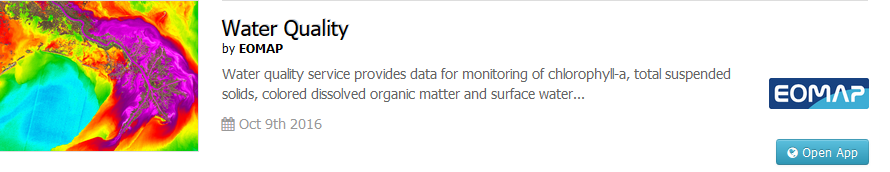

A new page with the geobrowser, data collections and processing services associated to the Water Quality application will appear.

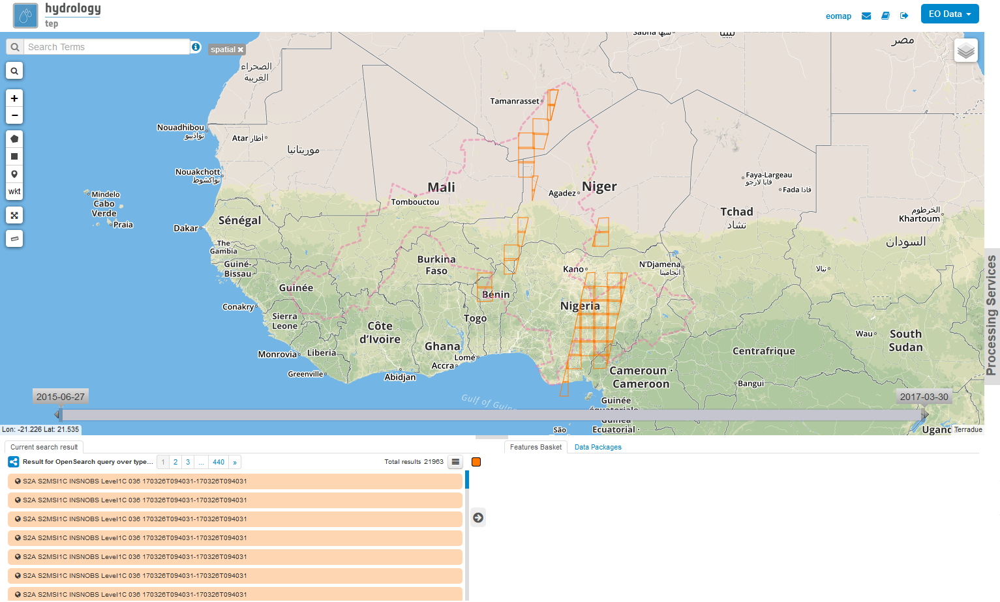

Open the 'Processing Services' section by clicking on **Processing Services** on the right-hand side of the geobrowser window:

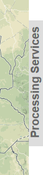

Within the 'Processing Services' section you will find the Water Quality Service in the 'Services' tab, click on the Icon to open the service:

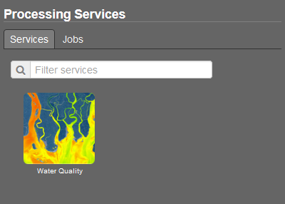
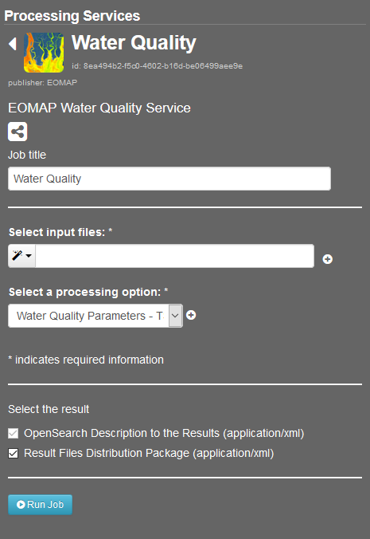

Select what kind of **EO Data** data you would like to process using the dropdown menu on the top right, so far Water Quality Service only supports Landsat8 and Sentinel2.

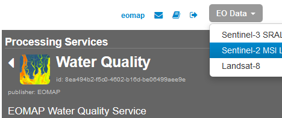

Zoom to your region of interest and use the **spatial filter** to spatially restrict the list of scenes: Click on the spatial filter symbol (little square) on the left-hand side of the geobrowser and draw a rectangle on the map. 

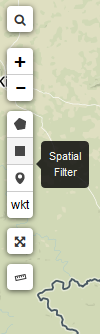
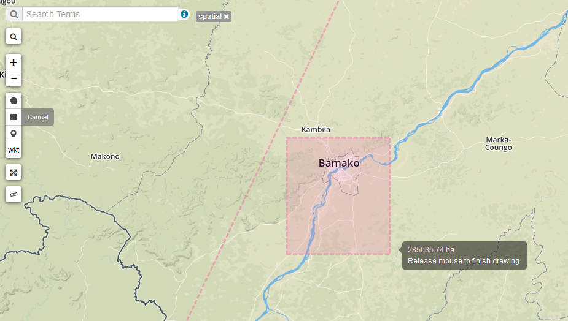

Use the **temporal filter** via the time slider at the bottom of the map to restrict the list of scenes temporally:

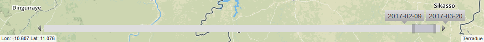

The list of available scenes is now filtered for your needs. If you identified a scene you would like to process you can add the scene via drag&drop from the scene list on the bottom left to the Water Quality Service:

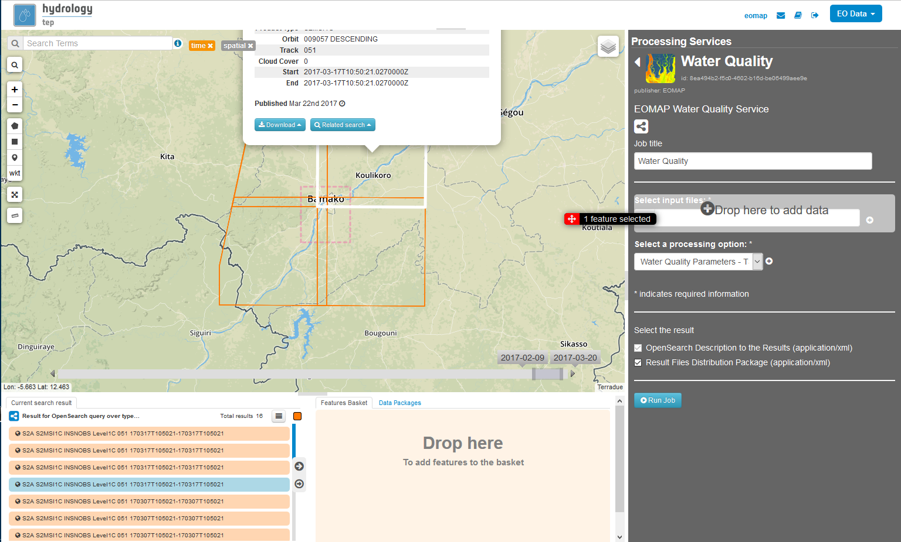

Select **one** of the three available **processing options**: 

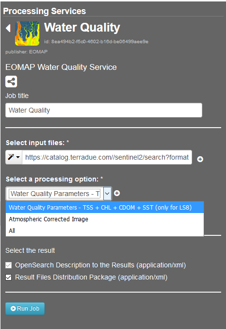

Select a **title** for your processing job, e.g. "My first Water Quality Job for Bamako" 

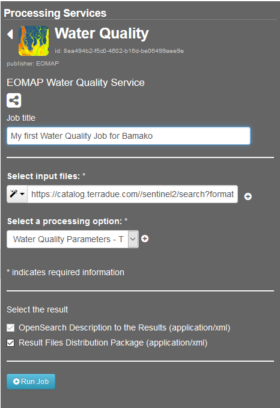

Now you can **either** click on the **Run Job** button

**OR** you could add more scenes to your job, from the same EO Data collection or you can even add scenes from another collection.
Therefore just change the **EO Data** collection in the dropdown menu on the top right:

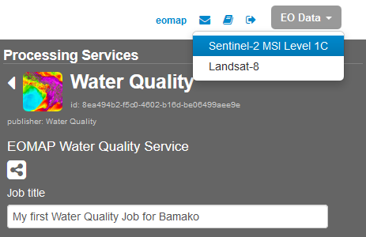

Your selected **spatial and temporal filters remain** and you can look for a scene from the other collection. 
If you identified another scene you would like to process can add the scene via drag&drop from the scene list on the bottom left to the Water Quality Service:

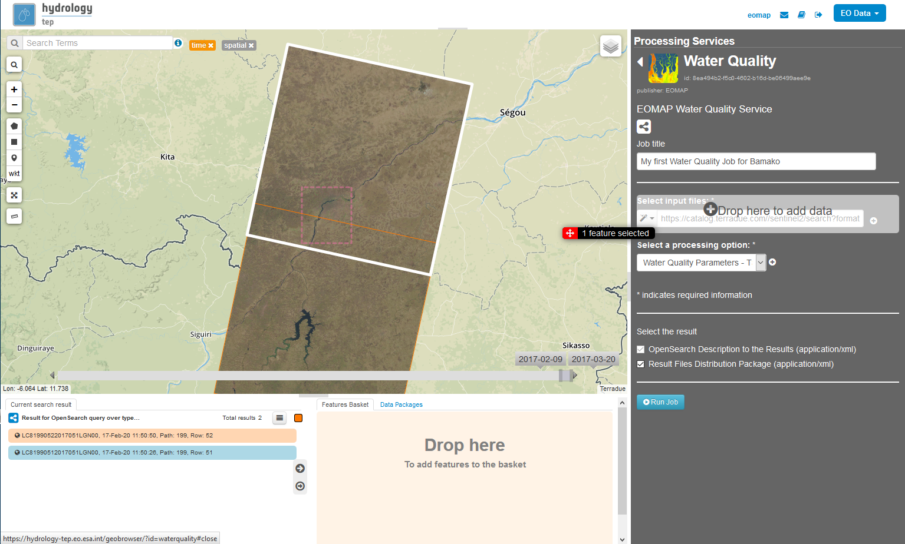

If your are satisfied with your scenes and settings click on the **Run Job** button to start the processing.

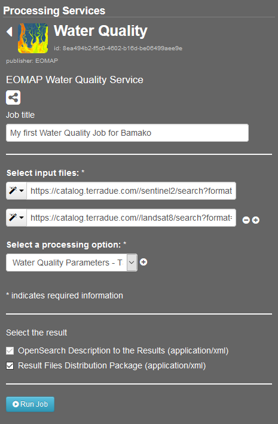

Results
-------

If your processing job finished sucessfully you can click on the **Show results** button.

The results of you processing will be shown in the search results list on the bottom left. The following results will be created: 

Processing option "Water Quality Parameters"
^^^^^^^^^^^^^^^^^^^^^^^^^^^^^^^^^^^^^^^^^^^^

* The water quality data is delivered as 32bit real value GeoTIFF, as well as 8bit scaled and colored GeoTIFF and corresponding metadata XML for each water quality parameter. 
* Furthermoe EOMAP's water quality products are accompanied by the processor's internal quality control mechanisms, resulting in pixel flagging in case of unreliable values. The QUC file indicates the main quality influencing parameter using a specific EOMAP quality coding classification scheme with corresponding grey values (GV), as shown in the following figure:

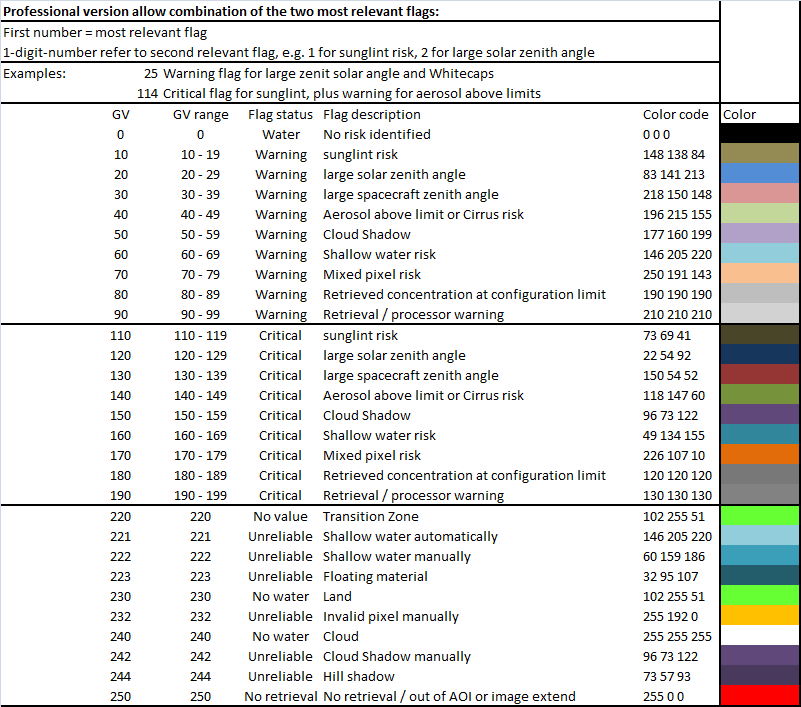
 
* Overview of files delivered per satellite scene (example):

  * Total Suspended Solids (TSS): 
  
    * GeoTiff 8bit, scaled and colored: *TSS_wq-tep193050_EOMAP_20161122_101338_LSAT8_m0030.tif*
    * Geotiff 32bit, real values in mg/l: *TSS_wq-tep193050_EOMAP_20161122_101338_LSAT8_m0030_32bit.tif*
    * XML, metadata: *TSS_wq-tep193050_EOMAP_20161122_101338_LSAT8_m0030.xml*
  
  * Chlorophyll (CHL): 
   
    * GeoTiff 8bit, scaled and colored: *CHL_wq-tep193050_EOMAP_20161122_101338_LSAT8_m0030.tif*
    * Geotiff 32bit, real values in μg/l: *CHL_wq-tep193050_EOMAP_20161122_101338_LSAT8_m0030_32bit.tif*
    * XML, metadata: *CHL_wq-tep193050_EOMAP_20161122_101338_LSAT8_m0030.xml*
  
  * Colored Dissolved Organic Matter (CDOM): 
  
    * GeoTiff 8bit, scaled and colored: *CDM_wq-tep193050_EOMAP_20161122_101338_LSAT8_m0030.tif*
    * Geotiff 32bit, real values in 1/m:  *CDM_wq-tep193050_EOMAP_20161122_101338_LSAT8_m0030_32bit.tif*
    * XML, metadata: *CDM_wq-tep193050_EOMAP_20161122_101338_LSAT8_m0030.xml*

  * Surface Water Temperature (SWT): 
  
    * GeoTiff 8bit, scaled and colored: *SWT_wq-tep193050_EOMAP_20161122_101338_LSAT8_m0030.tif*
    * Geotiff 32bit, real values in degree Celsius: *SWT_wq-tep193050_EOMAP_20161122_101338_LSAT8_m0030_32bit.tif*
    * XML, metadata: *SWT_wq-tep193050_EOMAP_20161122_101338_LSAT8_m0030.xml*
    
  * Watermask (WMA): 
  
    * GeoTiff, 8bit, GV 100 = water, GV 0 = no water: *WMA_wq-tep193050_EOMAP_20161122_101338_LSAT8_m0030.tif*, 
    * XML, metadata: *WMA_wq-tep193050_EOMAP_20161122_101338_LSAT8_m0030.xml*

  * Quality Coding (QUC): 
  
    * GeoTiff, 8bit: *QUC_wq-tep193050_EOMAP_20161122_101338_LSAT8_m0030.tif*
    * XML, metadata: *QUC_wq-tep193050_EOMAP_20161122_101338_LSAT8_m0030.xml*

  * Total Quality (QUT): 
  
    * GeoTiff, 8bit: *QUT_wq-tep193050_EOMAP_20161122_101338_LSAT8_m0030.tif* 
    * XML, metadata: *QUT_wq-tep193050_EOMAP_20161122_101338_LSAT8_m0030.xml*

  
Processing option "Atmospheric Corrected Image"
^^^^^^^^^^^^^^^^^^^^^^^^^^^^^^^^^^^^^^^^^^^^^^^

* The atmospheric corrected product is delivered as 32bit multi-channel GeoTIFF with corresponding metadata XML file.
* It provides reflectance data instead of scaled radiances or top-of-the atmosphere products and improves satellite imagery by minizing effects of haze and atmospheric aerosols. Reflectance will be delivered as Remote Sensing Reflectance above surface at nadir (RRS0+).
* Overview of files delivered per satellite scene (example):

  * Remote Sensing Reflectance (RRS): *RRS_wq-tep193050_EOMAP_20161122_101338_LSAT8_m0030.tif*, Multi-channel GeoTiff, 32bit
  * Remote Sensing Reflectance (RRS): *RRS_wq-tep193050_EOMAP_20161122_101338_LSAT8_m0030.xml*, XML, metadata

Processing option "all"
^^^^^^^^^^^^^^^^^^^^^^^

Products of both options, Water Quality Parameters and Atmospheric Corrected Image, described above are delivered.

Naming Convention
^^^^^^^^^^^^^^^^^

The naming of EOMAP product files follows a sequence of mandatory and optional elements:

``<product>_wq-tep<optional_ path/row(Landsat)>_EOMAP_<date>_<time> _<sensor>_<resolution>_<other_information>.<ext>``
  
* Products:

  * TSS - Total Suspended Solids
  * CHL - Chlorophyll
  * CDM - Colored Dissolved Organic Matter
  * SWT - Surface Water Temperature
  * WMA - Watermask
  * QUC - Quality Coding
  * QUT - Total Quality 
  * RRS - Remote Sensing Reflectance
   
* Sensors:
 
  * LSAT8 - Landsat 8
  * SENT2 - Sentinel 2

Validation
----------

The EOMAP processing system is proven and validated for a wide range of inland waters, lakes and riversaround the globe. Validations were performed within projects financed by the European Commission and are publicly available within theproject reports of the EU-GLASS [#f1]_ and EU-FRESHMON [#f2]_ projects. Especially in the most recent projects such as the EU-GLASS or the current EU SPACE-O, validations for the universal EOMAP processors mainly focus on independently retrieved water quality information in the standard processing mode.

For the Mekong delta, validation results are available in publications resulting from the WISDOM [#f3]_ project (BMBF). Further validations were undertaken by a number of clients in Australia, USA or Germany, including Water Agencies (e.g. Environmental State Authority Baden-Württemberg (LuBW), Federal Environmental Agency Germany (UBA and BAW), Environmental Authority Italy (ISPRA) or USGS USA), by large industrial companies such as Amec-Foster-Wheeler, Rio-Tinto or Woodside Energy as well as water industry and environmental consultancy companies. A large number of validation exercises is summarized and public available at the EOMAP homepage [#f4]_.

Comparability of in-situ and satellite data
^^^^^^^^^^^^^^^^^^^^^^^^^^^^^^^^^^^^^^^^^^^

When comparing EOMAP water quality products with in-situ data, the methodological differences between the various in-situ approaches and remote sensing need to be accounted for. For example, in-situ turbidity measurements are typically based on the scattering of light at a 90-degree angle between light source and detector, while remotely sensed turbidity products are physically related to a scattering angle of approx. 180 degrees (backscattering). Chlorophyll from in-situ measurements is typically based on one of three different methods, which include photometric, fluorescence and HPLC approaches and their subcategories. In the physics-based method applied at EOMAP, remotely sensed Chlorophyll is related to a linear relation of both, pigment-specific absorption and scattering. The pigments contributing to this quantifiable absorption, which is measured by the spectral satellite sensors, not only include various Chlorophyll pigments, but also other pigments such as Phaeophytin (see chapter information products). Of course, different environmental impacts and the algorithmic capabilities to correct them influence the intrinsic accuracy of the remote sensing method and need to be evaluated on their own.

Finally, the sampling differences between in-situ data and remote sensing products need to be accounted for within any validation exercise. Typical differences include the sampling location, the sampling depth interval, the sampling time, etc. For each of them, water quality parameters might vary naturally by typically 20-100%, even for measurements taken close to each other (e.g. for a time difference of 1 day or location differences of 1km horizontal or 3m vertical), and many times higher for larger sampling distances. 

Considering all these impacts, a match between the physics-based, satellite-derived water quality parameters and the various in-situ measures might hardly be closer than 30-50% for large scale validations. 

Results and applicability range
^^^^^^^^^^^^^^^^^^^^^^^^^^^^^^^

The results from the various stated comparisons are in accordance with the achievable expectation: Typically, differences of at least 30% and up to factor 2 can be observed for most water types, and the uncertainty range is approx. 50% than single in-situ measurements. Nonetheless, the method delivers independent results, and the uncertainty is still equivalent to the methodological differences to and between distinct in-situ approaches. The relevant temporal and seasonal changes can be reproduced very well for the majority of investigated cases. This proves evidence, that the physics-based approach for satellite data is intrinsically consistent and applicable as an independent method under most conditions. It deems to be an acceptable and valuable contribution, especially for large scale observations, as the natural variability of concentrations varies by more than 4 magnitudes, e.g. from approx. 0.1 to 1000 µg/l Chlorophyll, or, in extreme cases, even one magnitude for turbidity, if different scattering angles are observed.

However, caution and particular attention is still required for specific conditions and rather sensitive parameters, as also the intrinsic physics-based water quality accuracy can degrade:

* In general, the standard processor is only applicable for optically deep surface waters with a minimum depth between 50cm and 25m, depending on water turbidity and absorption. For optically shallow waters, increased errors will occur due to interferences of, e.g., proportions of seafloor in the water signal.
* In general, the sensitivity of products is degraded also in very dark natural waters, e.g. with very high concentrations of dissolved organic matter.
* The applicability range for Chlorophyll products and the HAB indicator is limitedfor water with exceptional optical properties, e.g. for extremely humic, calcareous or ferruginous waters.
* Chlorophyll is expected to be critical and not yet adequately validated in waters with very high ratios of scattering to absorption or with high inorganic absorption components, such as rivers. 
* The sensitivity to differentiate turbidity and especially Chlorophyll levels is decreased for older, less sensitive satellite sensors going back 30 years in time, such as Landsat 5 and 7.
* The turbidity and total absorption products have the highest validity for the widest range of water types. Here, the intrinsic accuracy of parameters only relies on the capability of the specific algorithms and corrections to match the specific optical conditions in water and atmosphere. 

The liability of products is sensitive to the specifications of the underlying satellite sensors and their specific characteristics, such as radiometric or spectral sensitivity. Still, with physics-based analysis methods, the products are comparable, as long as the common reference properties, absorption and scattering spectra, are maintained as comparison standard. The overall accuracy then results from the capability of the physical method to account for, correct or quantify the various environmental and sensor cased uncertainties.

.. rubric:: Footnotes

.. [#f1] EU FP7-Projekt GLASS: WP4 Validation report (29.2.2016): http://www.glass-project.eu/assets/Deliverables/GLaSS-D4.2.pdf
.. [#f2] EU FP7-Projekt FRESHMON: WP54 Final Calibration and Validation Report (Update 2013-10-31): http://www.freshmon.eu/static/media/uploads/fm_ph3_wp54_d543_update_pr.pdf , and
 EU FP7-Projekt FRESHMON: Projekt summary and final project report (29 Jan 2014): http://cordis.europa.eu/result/rcn/141731_en.html ; http://cordis.europa.eu/docs/results/263287/final1-fm-wp11-final-report.pdf
.. [#f3] Heege, T., Kiselev, V., Wettle, M., Hung N.N. (2014): Operational multi-sensor monitoring of turbidity for the entire Mekong Delta. Int. J. Remote Sensing, Special Issues Remote Sensing of the Mekong, Vol. 35 (8), pp. 2910-2926
.. [#f4] EOMAP Validation Report (2016): http://www.eomap.com/services/water-quality/ und http://www.eomap.com/exchange/pdf/EOMAP_Validation_Examples_Water_Quality.pdf
