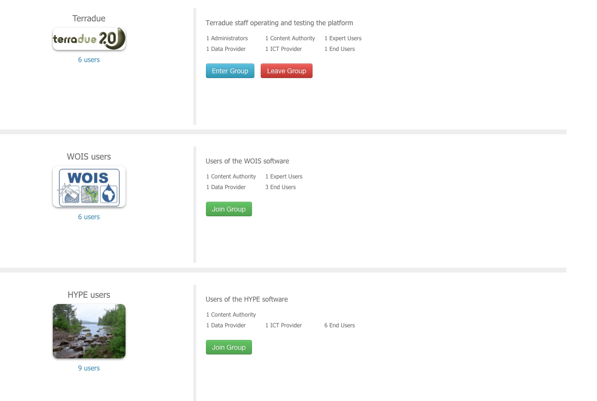

Groups
======

Find out how to see the list of existings groups, join one of them or view members and activities of your groups.

See list of groups
------------------

From the home page, click on the **View Groups** button to access the list of existing groups.

.. figure:: ../includes/homepage_groups.png
	:figclass: img-border
	:scale: 80%

The list of all Tep Hydrology groups will be displayed, with information about users of this group.

Join a group
------------

From the list of groups (see `See list of groups`_), click on **Join Group** for a group you are not already part of.

.. figure:: ../includes/group_join.png
	:figclass: img-border
	:scale: 80%
	
An administrator will validate your request, and you will receive an email once your request has been validated.
Then, you will be able to Enter this group.

Leave a group
------------

From the list of groups (see `See list of groups`_), click on **Leave Group** for a group you are already part of, but you don't want to be member anymore.

	
This action is immediate. To join again this group, your request will have to be validated by an administrator.

Enter a group
-------------

From the list of groups (see `See list of groups`_), click on **Enter Group** for a group you are already part of.

Information about the group, its users and their activities will be displayed.

.. figure:: ../includes/group_details.png
	:figclass: img-border
	:scale: 80%
