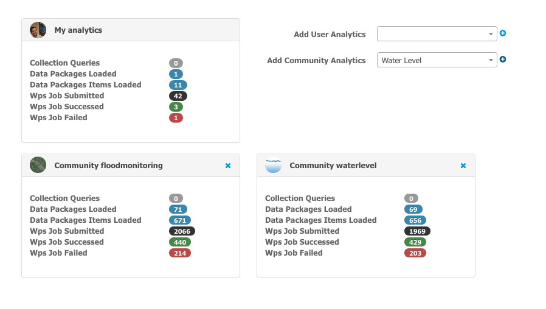

Activities area
===============

The portal gives the user a quick view of last activities performed by himself or other users or communities.
This page is accessible from the home page, by clicking on **Analyze Activities**.

The user will see activities amongst:

- number of data collection loaded
- number of data packages and items loaded
- number of wps jobs created and number of failed or succeeded

