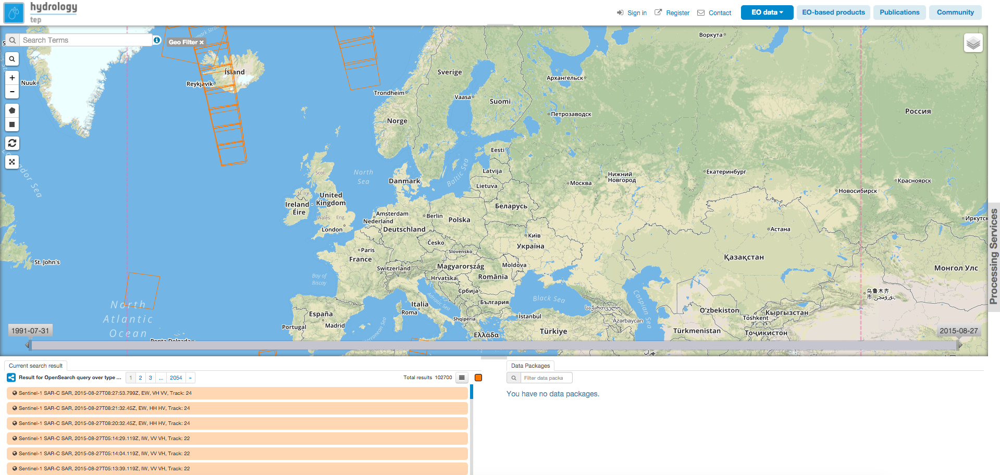
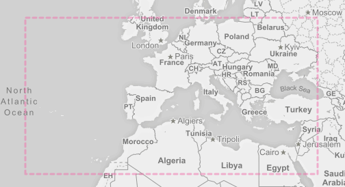
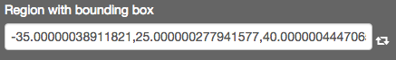
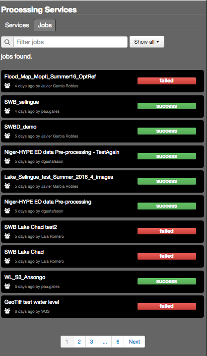
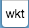

.. _geobrowser:

GeoBrowser area for data and Cloud processing services
======================================================

GeoBrowser
----------



.. req:: HEP-TS-DES-001
	:show:

	This section shows that TEP platform implement a geobrowser with web widgets.

.. req:: HEP-TS-ICD-016
	:show:

	This section describes how is structured and configured the geobrowser.


The GeoBrowser is composed of:

	- a `Map`_, where the user can make search query and see results
	- `Contexts`_ links
	- `Results`_ tab (initialy hidden)
	- `Processing services tab`_ (initialy hidden)

Map
~~~

The map is just a simple map, on which you can zoom in, zoom out and navigate.

Some buttons maybe used to interact with the map:

-  |geobrowser_button_search.png| search text
-  |geobrowser_button_search_area.png| search area
-  |geobrowser_button_plus.png| Zoom in
-  |geobrowser_button_minus.png| Zoom out
-  |geobrowser_button_query.png| Open query search tab
-  |geobrowser_button_polygon.png| Edit the search bbox by drawing a polygon on the map
-  |geobrowser_button_recbox.png| Edit the search bbox by drawing a rectangle on the map
-  |geobrowser_button_wkt.png| Allow to enter a WKT to be displayed on the map as bounding box
-  |geobrowser_button_dynamicsearch.png| Enable/Disable dynamic search (the search bbox is the current view on the map)
-  |geobrowser_button_fullscreen.png| Put the map in full screen
-  |geobrowser_button_layers.png| Change the background of the map | Select layers to be displayed.


Search area
***********
From the geobrowser, a search area can be accessed by clicking on the |geobrowser_button_search_area.png| button. This expands a view containing all search parameters associated to the current catalogue on which the search will be performed.
Some parameters are just free text, others can be chosen from a list, and some parameters can be filled from the geobrowser. This is the case of:

- the temporal parameter which can be filled by moving the temporal bar present on the geobrowser.

.. figure:: ../../includes/geobrowser_timebar.png
	:figclass: img-border img-max-width

- the geographical area which can be filled either from the bbox drawn on the map using |geobrowser_button_polygon.png| or |geobrowser_button_recbox.png|, either by uploading a shapefile or a geojson file, using the import button.

.. tip:: in the *Search Term* field supported wildcards are '*', which matches any character sequence (including the empty one), and '?', which matches any single character.

It is also possible to add layers on the map:

Data Results layer
******************

Display the results (orange polygons) of the current search or context.

Density map layer
*****************

Currently disactivated.

Area of interest
*****************



Area of interest may be defined by the user using the tools to draw a polygon or a rectangle on the map (see `Map`_). Once set, the search will be automatically updated with data corresponding to this AOI.

Area of interest external definition
````````````````````````````````````

Complex Area of interest can be defined by uploading or referencing a vector based file:

- shapefile (limited to 1MB)
- geojson (limited to 1MB)

Areas of interest based on hydrography features
```````````````````````````````````````````````

Area of interest may be defined using the geometry of a selected hydrography feature, such as a basin, a lake, or any water body.

Area of Interest according to processing service
````````````````````````````````````````````````

Area of Interest may be directly used to fill bounding box parameters exposed by Processing services.
When it is the case, the symbol |geobrowser_button_bboxparam.png| will be displayed along the parameter input field. Clicking on it will directly fill the input with the value of the current search bounding box.



Contexts
~~~~~~~~

.. figure:: ../../includes/geobrowser_contexts.png
	:figclass: img-border

Some pre-defined context are accessible on the top of the map.
One context is the result of a query on a specific catalog with pre-defined search parameters.
The existing pre-defined contexts are:

- EO data
- EO processing
- Publications
- Community

Results
~~~~~~~

.. figure:: ../../includes/geobrowser_resulttab.png
	:figclass: img-border img-max-width

The result tab is divided in two parts:

- On the left, the **Results Table** showing the list of current results displayed on the map. Results are paginatd, only 20 items are displayed, select another page to discover more products.
- On the right, the **Features Basket** showing all data in the current basket and **Data Package** panel showing list of data packages accessibles for the user.

Results can be dragged fron the left table to the basket. Then the basket can be saved as a new data package and shared with other users.
Saved Data packages can then be loaded into the basket. (see :doc:`data <../data>` for more details)

Cloud Processing
----------------

Processing services tab can be expanded by clicking on *Processing Services* on the right of the map.
It is composed of two sub tabs.

Processing services tab
~~~~~~~~~~~~~~~~~~~~~~~

This tab contains the list of available Processing Services. Usually, only 20 Processing services are displayed. If you are looking for a specific one, you can filter the results using the **Filter services** input.

Jobs tab
~~~~~~~~

This tab contains the list of available jobs associated to your user.
Details on jobs can be accessed by clicking on the title of the job.




.. |geobrowser_button_query.png| image:: ../../includes/geobrowser_button_query.png
.. |geobrowser_button_plus.png| image:: ../../includes/geobrowser_button_plus.png
.. |geobrowser_button_minus.png| image:: ../../includes/geobrowser_button_minus.png
.. |geobrowser_button_search_area.png| image:: ../../includes/geobrowser_button_search_area.png
.. |geobrowser_button_search.png| image:: ../../includes/geobrowser_button_search.png
.. |geobrowser_button_polygon.png| image:: ../../includes/geobrowser_button_polygon.png
.. |geobrowser_button_recbox.png| image:: ../../includes/geobrowser_button_recbox.png
.. |geobrowser_button_dynamicsearch.png| image:: ../../includes/geobrowser_button_dynamicsearch.png

.. |geobrowser_button_fullscreen.png| image:: ../../includes/geobrowser_button_fullscreen.png
.. |geobrowser_button_layers.png| image:: ../../includes/geobrowser_button_layers.png
.. |geobrowser_disaster_big_group.png| image:: ../../includes/geobrowser_disaster_big_group.png
.. |geobrowser_disaster_small_group.png| image:: ../../includes/geobrowser_disaster_small_group.png
.. |geobrowser_disaster_event.png| image:: ../../includes/geobrowser_disaster_event.png
.. |geobrowser_button_bboxparam.png image:: ../../includes/geobrowser_button_bboxparam.png
