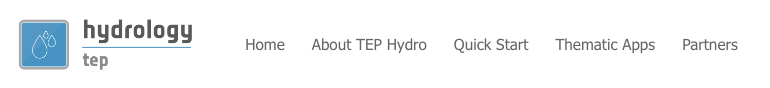

Menu bar
========

The menu bar is always visible, apart from the geobrowser page. It contains the following links:

- `Home`_,
- `About Tep Hydro`_,
- `Quick Start`_,
- `Thematic Apps`_,
- `Partners`_

Home
----

A simple way to go back to the home page of the portal.

About Tep Hydro
---------------

This page describes the Tep Hydrology platform.

Quick Start
-----------

This page gather all quick start guides, covering new user's needs.

Thematic Apps
-------------

This page describes the existing Thematic Applications.

Partners
--------

Description of the partners in the project.