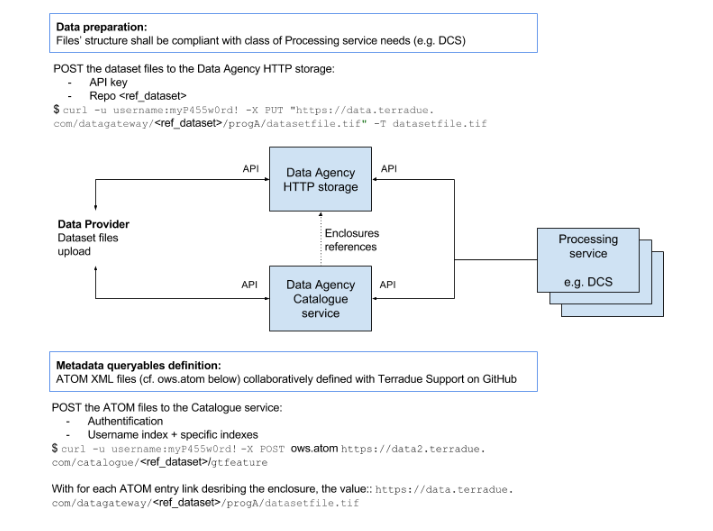

A data casting facility
=======================

Context
-------

The Platform allows data providers to promote the usage of their hosted data,
by having dedicated catalogues to manage series/datasets selected for exploitation with the platform' services.

These provided data resources can be searched and retrieved by users from the platform, 
and exploited through cloud appliances bound to a proper usage policy.

I am a data provider, how can I proceed to get registered on HEP ?
------------------------------------------------------------------

For the time period of the Platform Validation with early adopters, a data provider partner can interact very simply with the support team, in order to add a catalog entry on the platform.

This is the minimum capability offered at this stage. In the future, it is planed to offer authorized Data Providers with a service for self-registration of their dataset series.

To get more information:

Contact us: hydrology-tep at esa.int

Indicate the resources you would like to promote on the platform, and the usage policies to be bound with the provided data resources.

What data provider should do to have their data published ?
-----------------------------------------------------------

Introduction
~~~~~~~~~~~~

For data providers needing a permanent storage to share datasets of reference to be ingested by processing jobs (especially other that EO data), the Platform is evolving to provide Partners with more autonomy in the data preparation tasks. Up to now, Platform users could make use of the S3 service (Simple Storage Service) to upload such datasets, and have them referenced on the Platform’s catalogue service by interacting with the Operations Support team at Terradue (via the Support site). In some cases, when interest from several Platform partners for some dataset of reference is well identified, the Support team can perform the files upload and referencing operations on behalf of users. As a Platform evolution, Partners can now get additional Platform credentials associated to their user profile, in order to perform the dataset files upload and referencing operations they need to perform.

Working with the Cloud Platform’s S3 storage (legacy)
~~~~~~~~~~~~~~~~~~~~~~~~~~~~~~~~~~~~~~~~~~~~~~~~~~~~~

Users of the Cloud Platform can still create their own S3 bucket (the ‘mb’ command below stands for make bucket) and put their dataset files (here we give only one example) in the S3 bucket:

.. code-block::

	$ s3cmd mb s3://dataset_folder_name
	$ s3cmd put /data/public/corine_land_cover_2012.tiff s3://dataset_folder_name

This solution currently guarantees user authentication as a Platform referenced user and a flexible distributed storage management in supporting the upload tasks. After this step, the Partner registers on the Platform the prepared bucket as a validated source for the publication and referencing, which will trigger the next step, about referencing these datasets in the Platform’s catalogue service, so they can be queried and retrieved from data processing workflows using a standard API and protocol. 

Working with the Cloud Platform’s HTTP storage 
~~~~~~~~~~~~~~~~~~~~~~~~~~~~~~~~~~~~~~~~~~~~~~

A further requirement to support data providers on the Platform is to make the uploaded dataset as web accessible for distributed processing tasks. From this perspective, the Cloud Platform solution now automates the creation of a HTTP storage, available from all the processing nodes of a data processing cluster. From the deployment perspective, it translates into the Platform’s Data Agency providing a shared storage space available both from the Private and Public Clouds. Once this step is performed, it is transparent for the developed application to work with it during the integration and testing phase on Terradue Cloud Platform, or after deployment on the selected production Cloud. 

Referencing the datasets 
~~~~~~~~~~~~~~~~~~~~~~~~

Once the datasets location and structure is defined on the Cloud Platform, users can generate a catalogue index over it. The index will be created by a POST operation of a XML document providing the definition of the catalogue queryables describing the different dataset files. The POST shall done to a URL endpoint of the Data Agency following this template:

.. code-block:: url

	https://data2.terradue.com/eop/shared/dataset/search

Once the description document is registered and the catalogue index created, the application can query the catalogue from the same URL, extended with the ‘search’ path element:

.. code-block:: url
	
	http://data.terradue.com/gs/catalogue/myindexname/gtfeature/search

Metadata elements can be retrieved by an application in different encoding formats:

.. code-block:: url
	
	http://data.terradue.com/gs/catalogue/myindexname/gtfeature/search?format=atom (default)
	http://data.terradue.com/gs/catalogue/myindexname/gtfeature/search?format=json

The XML content (ATOM encoding) that will create the index on the Platform’s Data Agency is posted as follows, according to the metadata profiles supported by the catalogue service:

For standard data products potentially shared by many applications (common user requirements being identified), the process above must be coordinated with the Operations Support team at Terradue to ensure no duplicates are created.