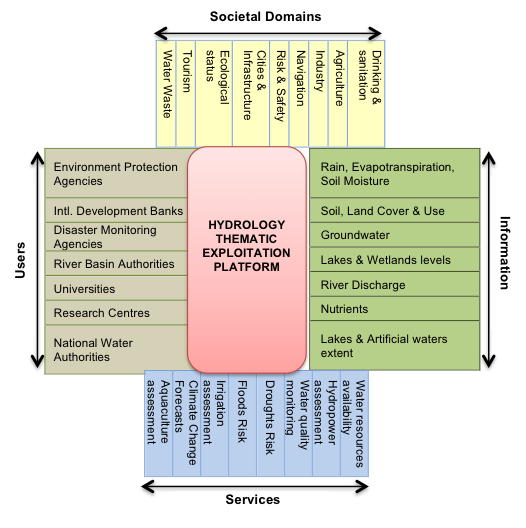

Purpose of the Hydrology Thematic Exploitation Platform
========================================================

Background
----------

Water quality and access is essential for socio-economic development and for maintaining healthy ecosystems.  In fact, the World Economic Forum (Global Risk Report 2016) identifies water crises as one of the top 5 global risks because humanity relies on fresh water not only for drinking, but also for activities such as agriculture and energy production.  
Today, Earth Observation (EO) satellites are capable of delivering transparent and independent observations to help us manage our fresh water sources efficiently and sustainably, and on a transboundary scale.  Such information covers:

	•	Water quality, water extent and water level 
	•	River basin characterisation 
	•	Flood forecasting and mapping 
	•	Water productivity (soil moisture, precipitation and evapotranspiration) 

However, the data volume being offered, the diversity of sources, and the different formats in which the data arrives pose a major challenge for water management users to try to exploit efficiently all of the data available.

Objectives
----------

The Hydrology Thematic Exploitation Platform (Hydro-TEP) is an ESA initiative which aims to facilitate EO data exploitation by water user communities, minimising users’ time and resources on ICT matters. The specific objectives of Hydro-TEP are to provide: 

**A SYSTEM PLATFORM** - a technical system framework where users can:

	•	Access and discover EO data in a rapid, cost-effective and user-friendly manner;
	•	Develop, prototype and benchmark algorithms, processors and data from services in a rapid, cost-effective and user-friendly manner;
	•	Share software, toolboxes, infrastructure and computer resources through the Cloud;
	•	Upload/integrate their own EO products, EO services, hydrological models and local data;
	•	Integrate their ESA Water Observation Information System (WOIS) workflows and data into a Cloud environment.

**A SERVICE PLATFORM**, which provides an ensemble of EO services and EO data products customised for hydrology applications, such as flood monitoring, small water bodies mapping, water quality monitoring, water level monitoring, and assimilation of EO data into hydrological modelling. 

**A COMMUNITY PLATFORM**, to encourage an open, collaborative, inclusive and evolving water user community where users can share information, knowledge, algorithms, methods, tools, results and services.

These Hydro-TEP capabilities will be demonstrated during two pilot studies in the river basins of the Niger and Red river. As an open platform the user community is encouraged to run their own studies on the Hydro-TEP.

Technological advances
----------------------

The main technological challenge of Hydro-TEP is providing, in a user-friendly manner, all the EO information services and functionalities required by the large ensemble of users and societal domains.  The scope is ambitious but it shall guarantee an effective and flexible customisation and integration of all technological components (data access, visualisation, data processing) into users’ existing systems.

Users
-----

The members of the water user community already involved in the demonstration of Hydro-TEP are:

	•	Scientific Community (Universities, technical and research centres):
		
		-	Water Resources University in Vietnam
		-	Hanoi University of Natural Resources in Vietnam
		-	WASCAL centre in Burkina Faso
		-	University C.D. in Morocco

	•	Regional mandated water authorities and River Basin organisations
		
		-	Volta Basin Authority in Burkina Faso
		-	AGRHYMET Regional Centre in Niger
		-	OSS in Tunisia
		-	RCRMD in Kenya
		-	Niger Basin Authority

	•	National water authorities (Water departments, meteorological institutes)
		
		-	DGADI/APEFE in Burkina Faso
		-	DNH, ABFN, PDDDIN in Mali
		-	Global Water Partnership in Ghana 
		-	Hydrological Services Department of Ghana 
		-	SANSA in South Africa
		-	Water Resources Commission of Ghana

A key goal of Hydro-TEP is to encourage ever greater participation of the user community.  Hydro-TEP openly welcomes the involvement of any actor interested in any water application, such as:

	•	Research Organisations (e.g. hydrological institutes)
	•	River Basin organisations, national water authorities, and environment agencies 
	•	Existing Water Communities (e.g. TIGER initiative, WaterNet, CEOSS Flood Pilots)
	•	International Public Initiatives (e.g. international development bank partners)
	•	European Initiatives/Projects/Services (e.g. H2020 projects)
	•	EO water specialists and service providers
	•	EO data providers
	•	ICT providers and integrators

The Team
--------

Hydro-TEP is being developed by:

.. figure:: ../_static/logoconsortium.png
	:figclass: align-center
        :width: 100%
        :align: center

Contact Information
-------------------

**Website**:	https://hydrology-tep.eo.esa.int/ - https://tep.eo.esa.int/ 

**Lead Partner**:     	isardSAT S.L: Bernat Martínez (+34933505508, Bernat.martinez[at]isardsat.cat)