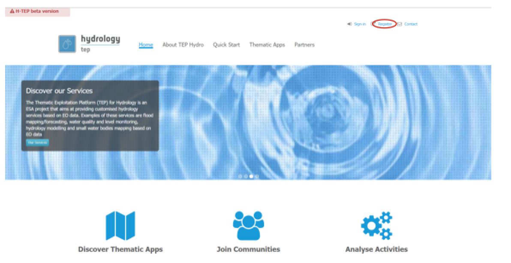
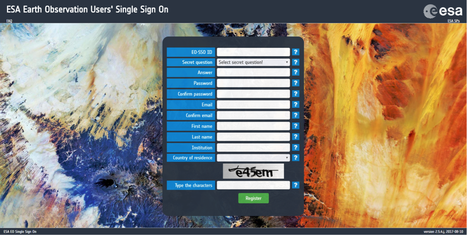
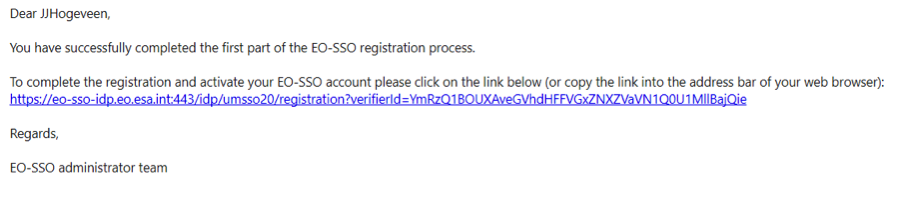
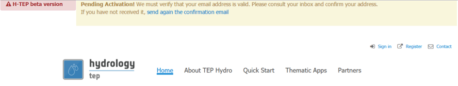
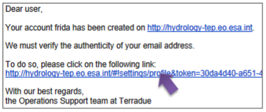

.. _QSM1:

How to become a member of HTEP
------------------------------

To make use of the functions and features of the Hydrology Thematic Exploitation Platform (HTEP), it is necessary to first register yourself at ESA’s Earth Observation Users’ Single Sign On. This document shows you step by step how to register and log onto the HTEP Community Portal.

Register on ESA EO Users’ Single Sign On
========================================

1. Please access the HTEP Community Portal through the URL provided: https://hydrology-tep.eu/#!. 

	Figure 1: The HTEP Community Portal

2. On the top right a register button is displayed, encircled in red. Click on this button to go to the ESA EO Users’ Single Sign On registration page. 

3. Figure 2 shows the ESA EO Users’ Single Sign On registration. Fill in all required information. Click on the question mark behind the field for extra info. Afterwards click on Register to continue. A confirmation as shown in Figure 3 is displayed and an email is sent.

	Figure 2: The ESA EO Users' Single Sign On Registration Page

.. NOTE::
	Password must contain at least 8 characters, with at least one upper case lettre, one lower case letter, one integer and a special character (!, @, ?, ...).

	Figure 3: Confirmation of Registration at ESA EO Users Single Sign On

4. Open your email and click on the link provided by the EO-SSO administrator team. You will be
directed to a page confirming the activation of your account, as indicated by Figure 5.

	
	Figure 4: Email sent by the EO-SSO administrator team

.. figure:: includes/qsm1-f5.png
	:align: center
	:width: 80%
	:figclass: img-container-border	
	
	Figure 5: Confirmation of Account Activation

Sign into HTEP Community Portal
===============================

1. Go back to the HTEP Community Portal: https://hydrology-tep.eu/#!

2. On the top right of the HTEP Community Portal, click on Sign in button. The button is located left of the register-button as indicated in Figure 1. You will be redirected to the sign-in page of Figure 6.

	Figure 6: HTEP Community Portal Sign in page

3. Fill in your newly created EO-SSO ID, password, max idle time (maximum time of no activity
before you are automatically logged off) and max session time (maximum time before you
are automatically logged off) and click on Login. The message below will appear at the HTEP
Community Portal homepage.

	Figure 7: Pending Activation Message after First Sign in at HTEP Portal

4. Access your email and click on the link provided by the Operations Support team at Terradue
to verify your email address, as indicated by the arrow in Figure 8.

	Figure 8: Email Address verification email

5. Repeat step 1 and 2 of this section: Return to the HTEP Community Portal and Sign in again.
After signing in a welcome message is displayed on the top of the HTEP Community Portal, as
displayed in Figure 9. You are now registered, signed in and ready to use the HTEP platform!

	Figure 9: Welcome message after signing in at HTEP Community Portal