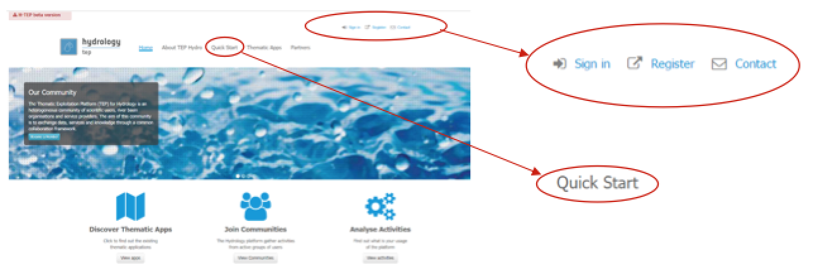
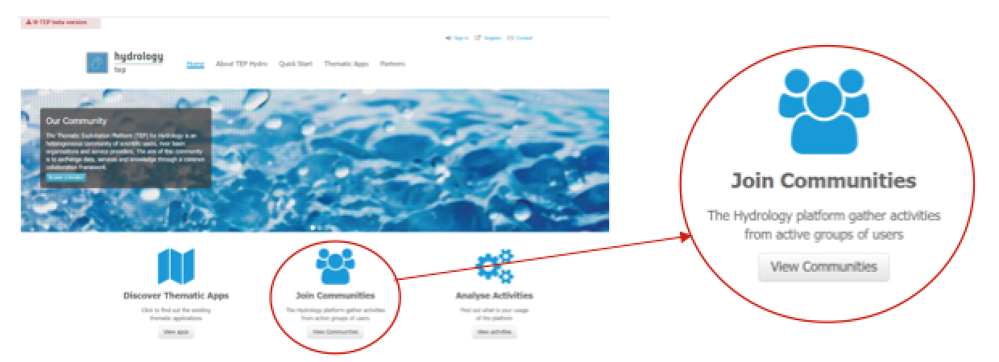
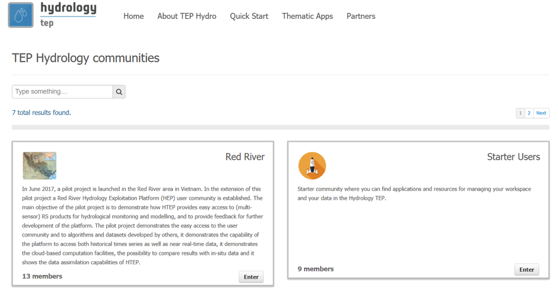
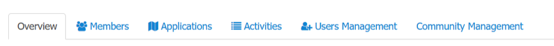
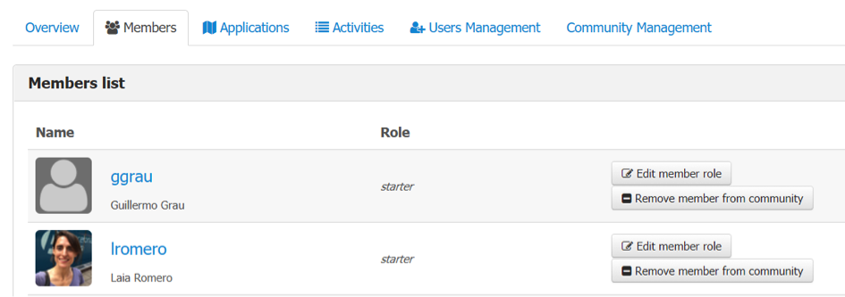
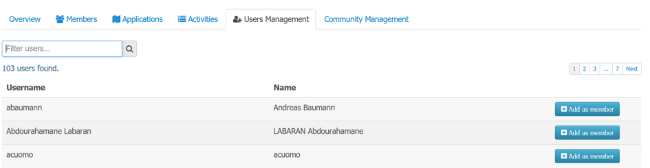
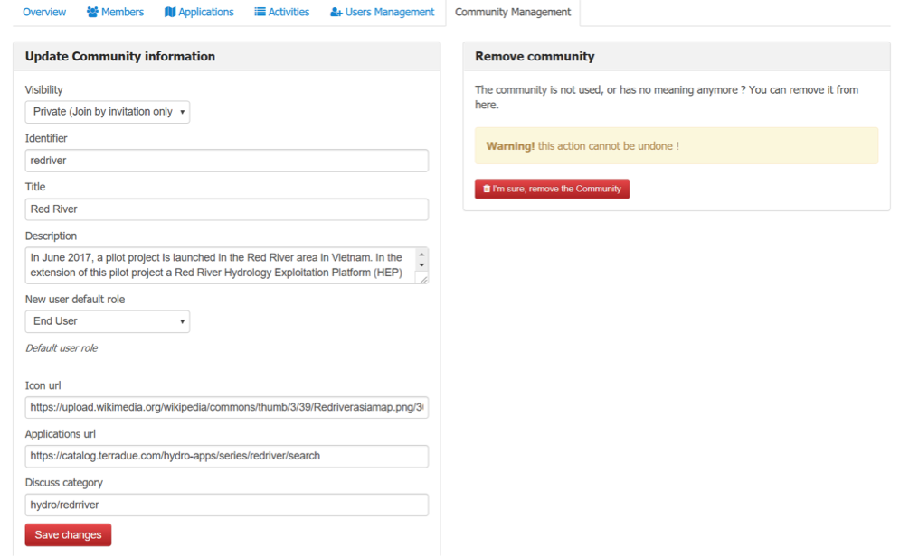

.. _QSM10:

Manage Your Community
---------------------
	
Once you are an explorer user and admin of your community, you can manage and control everything within your community. This guidelines shows you the various privileges you have as a manager/admin of a community and how to work with them.

Manage Your Community
=====================

In this manual it is assumed you are already member of a community (otherwise please follow Quick Start Manual 4), that your user role has been upgraded from starter to explorer and that you have manager/admin privileges in your community of interest.  

Accessing your Community
~~~~~~~~~~~~~~~~~~~~~~~~

1. Enter the HTEP Community Portal and Sign in with your HTEP community user account. There is no preferred internet browser. However, for this specific tutorial, Google Chrome is used as the internet browser. 

You do not have an account yet? Then first register on the platform. To register at the platform, it is advised to follow the steps in the Quick Start Manual How to become a user of HTEP, which can be found under the Quick Start-tab in the menu of the HTEP Community Portal. 

 
	Figure 1: Step 1 – HTEP Community Portal   

2. Access the Join Communities. Open the list of existing communities by clicking on View Communities below to Join Communities-icon.

 
	Figure 2: Step 2 - Access the communities

3. A list of available Communities is shown, each with the community title and a short description of the community. For this tutorial the Red River community is accessed by clicking on Enter. 

 
	Figure 3: Step 3 – Available communities on HTEP

4. After accessing the community, on the top of the community the menu as shown in Figure 4 is displayed.  

 
	Figure 4: Step 4 – The Community Page Menu

Manage the Members (roles) within a Community
~~~~~~~~~~~~~~~~~~~~~~~~~~~~~~~~~~~~~~~~~~~~~

1.	Select the Members tab of the menu of Figure 4. An overview of all the community members as in Figure 5 is shown. Here you find information about each member, for instance the role they have within the community and on HTEP. Clicking on the username will guide you to a page with additional user details, such as the amount of jobs created by that user.
 

 
	Figure 5: Overview of community members

2.	To delete a member from the community, simply click on Remove member from community and confirm your action in the pop-up screen that will appear.

3.	To edit the role of a user in the community, click on Edit member role button. A pop-up screen appears where a role can be assigned to the specific user as shown in Figure 6. Select the role you wish to assign to the user and click Save changes.  
 
.. figure:: includes/qsm10-f6.png
	:align: center
	:width: 60%
	:figclass: img-container-border	
 
	Figure 6: Assign a role to a member

Community User Management
~~~~~~~~~~~~~~~~~~~~~~~~~

1.	Select the User Management tab in the community menu of Figure 4. An overview of all HTEP users is given as shown in Figure 7. You can use the search field to find the user(s) you wish to add to your community. You can search by name or by username.

2.	To add a member to your community, simply click on Add as member behind the user of interest and assign a role to the user in the pop-up screen that will appear.

 
	Figure 7: Users management within a community

Community Management
~~~~~~~~~~~~~~~~~~~~

1.	Select the Community Management tab in the community menu of Figure 4. An overview of community information is given as shown in Figure 8.

2.	Remove community will remove your community. Special care needs to be taken with this button, as this action cannot be undone and will delete the entire community and its information!

3.	The Update Community information exists of multiple fields that can be used to manage your community:

	-	Visibility: choose if you want your community to be open or private. An open community means that every member of HTEP can become member of the community on its own initiative. As a private community, members of HTEP can only become member of the community if the community managers invite them.
	-	Identifier: Choose an identifier for your community. For the Red River this is redriver.
	-	Description: Give a short description of your community. In the community overview page, this description will be displayed so HTEP users know whether or not the community if of their interest.
	-	New user default role: Click on this to open a dropdown menu with the multiple roles a user may have on HTEP and within the community. The chosen user role (for now this is end user) is the default role that all new Red River community members will have once they become a member of the community.
	-	Icon URL: Give the URL of an image that will be used as the icon of the community. This picture will be displayed when users browse to the community overview page.
	-	Applications URL: Leave this at default, it is the URL where all application information is stored.
	-	Discuss category: Leave this at default also, it is the extension that needs to be used in the Terradue Discussion board to link the discussion to the Red River community. 
	-	Click on Save Changes to save any changes you made in the Update Community Information box. 

 
	Figure 8: Community Management

