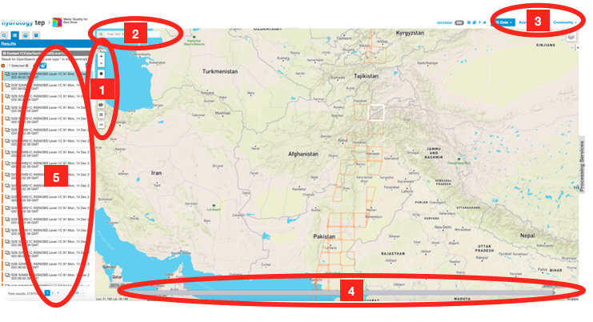
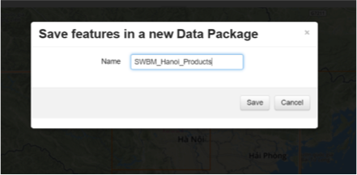
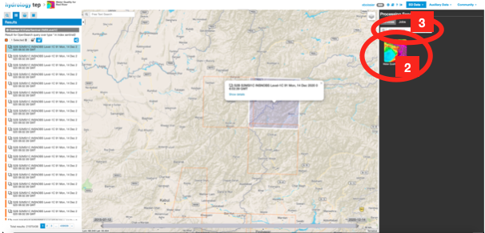

.. _QSM3:

An Overview of the Geobrowser Features
--------------------------------------

Once you are logged onto the HTEP platform (see :doc:`Quick Start Manual 1 <qsm1>`) and you have accessed your application of interest using the HTEP Community Portal (see :doc:`Quick Start Manual 2 <qsm2>`) you are in the Geobrowser. This document provides you an overview of the various available functions and features within the Geobrowser. 

.. NOTE:: 
	Some of the functions and features below are not visible if you are not registered and logged onto HTEP. Also, some features and functions might be invisible because your user status has not increased from ‘starter’ to ‘explorer’ yet.

The Geobrowser
==============

Once you have accessed your thematic application of interest the Geobrowser opens. The geobrowser for the Small Water Bodies Mapping for Red River is shown in Figure 1. Within the Geobrowser you are -amongst others- able to search and collect data, process data, reproduce results, and share data and results with your community, other HTEP users or even with visitors.

	
	Figure 1: The Geobrowser of SWBM for Red River Application (1)

Search and collect data
~~~~~~~~~~~~~~~~~~~~~~~

1. In this part of the Geobrowser you find various tools to perform a spatial data search: for example by drawing a rectangle or polygon of your area of interest, or by using a predefined WKT-string. Also you can zoom in and out on the map using the plus and minus signs respectively.

2. The search field can be used to search for specific data types, such as for example GRD or RAW data. Please be aware the search field cannot be used to perform geographical searches. 

3. Here you can select various satellite Earth Observation (EO) data sources. For each thematic application, data from a specific number of satellites can be used. A dropdown list with available satellite data sources for the specific application appears by clicking on EO Data. 

4. Besides a spatial data search you can also apply a temporal filter. Simply click on the start and end date respectively, and drag to your dates of interest. To undo a spatial or temporal filter, click on the cross x of the specific filter next to the search field indicated of point 2.

5. After your searches, this box shows the data products that meet the requirements of your search. Hovering the data products causes the specific product to be highlighted on the map. As such you can easily visualize the area covered by the specific data product. It also possible to show or hide the data product results on the map. This can be done using the little icons behind the data products that will appear while you hover the data product.
 
.. figure:: includes/qsm3-f2.png
	:align: center
	:width: 80%
	:figclass: img-container-border	
	
	Figure 2: The Geobrowser of SWBM for Red River Application (2) 

6. Selecting a data product causes a pop-up to appear with information and meta data about the specific data product, as shown in Figure 2. 

7. If you wish you can download the data product by clicking on Download. Also you can do a related search: as such you can search for a data product within the same area or time range -or a combination thereof- of the current data product. 

8. Once you have found suitable data you would like to process, you can select your data products of interest in the results box and drag them into this box: the features basket. 

9. You can save the selection of data products you dragged into the features basket as a Data Package. As such you can easily load your data collection at any time or share your data with your community and/or others. 

	Figure 3: Save data products in a Data Package

.. figure:: includes/qsm3-f4.png
	:align: center
	:width: 80%
	:figclass: img-container-border	

	Figure 4: Overview of Data Packages

10.	To access your existing Data Packages, there is a Data Packages tab next to Features Basket tab. See Figure 4. Here you can for example load or share your Data Package.

Process Data
~~~~~~~~~~~~

1. Once you have all data products of interest in your features basket, these data products can be processed. The Processing Services tab on the right side of the Geobrowser as indicated in Figure 5, will open the processing services.

	
	Figure 5: The Geobrowser of SWBM for Red River Application (3)

2. An overview of the available services within this thematic application is given. Hovering a service provides you a small summary of the service and its developer. 

3. Currently for Small Water Body Mapping there is only one service available, but the search field can be used to find your service of interest once there is an extensive number of services available. 
 

	Figure 6: Available processing services for a specific thematic application

4. Accessing the service provides you an overview of the required inputs for the specific service, as indicated in Figure 7. 

5. Click on Run Job on the bottom to start processing your newly created job.

	Figure 7: Input required for a specific service

Reproduce Data and Visualise Results
~~~~~~~~~~~~~~~~~~~~~~~~~~~~~~~~~~~~

1. After a job is successfully processed, the screen of Figure 8 will appear containing information about the run job.   
 

	Figure 8: Summary of a successfully run job

2.	Resubmit Job provides the possibility to rerun a job. As such it is possible to reproduce data, or to easily make small adaptions on earlier run jobs without having to go through the whole process of searching, collecting, selecting and applying data to the processing service.

3.	To visualize the results (in the Geobrowser), the Show Results button can be used to load the results. 

Share Data and Results
~~~~~~~~~~~~~~~~~~~~~~

During the process described from Section 2.3.1.1. until 2.3.1.3, it is possible to share each step with other HTEP users. Most important features are the ability to share your Data Packages and your job results. The |share| icon indicates you can share something. For a Data Package this icon can be found as explained in step 10 of Section 2.3.1.1 (Figure 4). For a successful job this icon can be found on the top, as indicated in Figure 8.

1. Figure 9 shows the share pop-up. 

2. Here you can choose to share your Data Package or Job on social media such as Facebook or Twitter, or just simply copy and paste the shareable link. Keep in mind that another person can only see your data or results if this person is an HTEP user.

3. Here you can choose for who your Data Package or Job is visible:

 - **Do not share:** This is the default setting and means only you can see the data package or job result.
 - **Share with anyone:** Selecting this button means your data package and job results will be visible for anyone who uses HTEP.
 - **Restricted sharing:** Selecting this button means your data package and job results will be visible only for a limited number of users: for example only members of a specific community.

	Figure 9: Sharing a Data Package

.. |share| image:: ../includes/share_button.png

