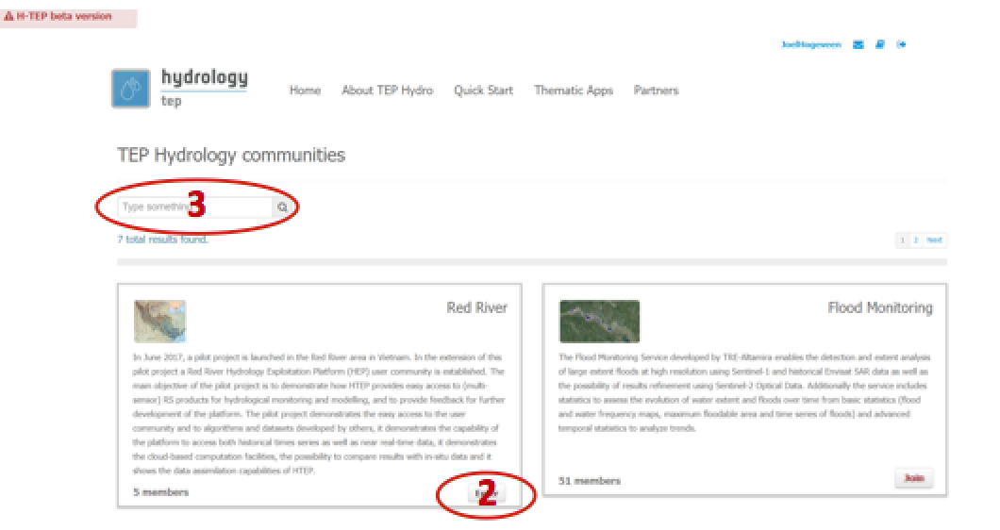
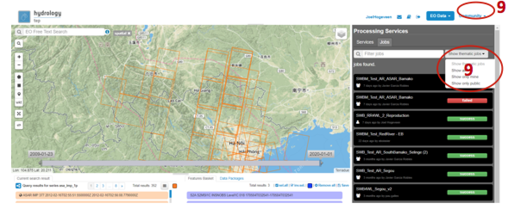
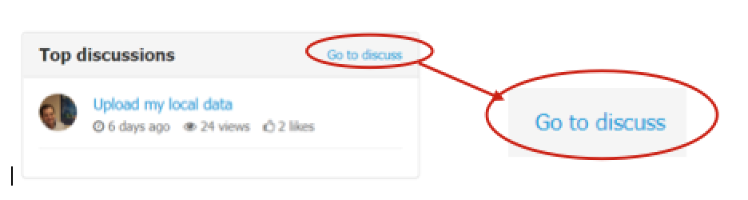
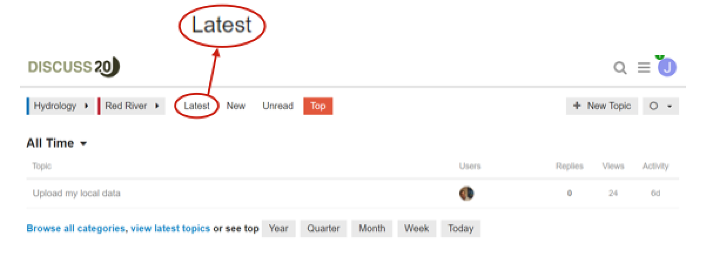

.. _QSM4:

Become Member of a Community
----------------------------
  	
Within the HTEP Community, you can become a member of your own community: A group of HTEP users who share a similar interest, for instance the same geographical area, the same organization/institution or the same research area (e.g. flooding, water quality, etc). This document shows you how to join a community and guides you through the community webpage(s). 

..NOTE:: 
	Some of the functions and features below are not visible if you are not registered and logged onto HTEP. Also, some features and functions might be invisible because your user status has not increased from ‘starter’ to ‘explorer’ yet.

Become Member of a Community
============================

One of HTEPs possibilities is to become member of a community: a group of people sharing a common interest, organization/institution and/or research area. 

Join a Community
~~~~~~~~~~~~~~~~

1. Access the HTEP Community Portal. Click on View Communities in the HTEP Community Portal to access an overview of existing and available communities as shown in Figure 1. Please consult :doc:`Quick Start Manual 2 <qsm2>` if you cannot access the HTEP Communities webpage.

	
	Figure 1: List of existing HTEP Communities 

2. You can become member of a community by clicking on Join. Once you have joined a community you can access your community by clicking on Enter.

3. Currently the number of existing communities is small. This search field allows you to search for your community of interest once this number has significantly increased.

An Overview of Features within a Community
~~~~~~~~~~~~~~~~~~~~~~~~~~~~~~~~~~~~~~~~~~

1. In the previous section it is discussed how you can join and enter your community. After entering your community of interest, you will be directed to your community homepage as shown in Figure 2.

2. A summary of the specific community. This may for instance be a geographic area, an organisation and/or an hydrologic expertise.

3. Here you can go back to an overview of all existing communities, or you can leave the current community as a member.

.. figure:: includes/qsm4-f2.png
	:align: center
	:width: 80%
	:figclass: img-container-border	 
	
	Figure 2: Overview of a Community homepage

4. The menu of the current community, existing of the following tabs. Not all tabs might be visible to you, as for some of them special community manager rights are required. The following tabs are available:

	- **Members:** An overview of all members of that community and their role within the community.
	- **Applications:** A list of thematic applications available and of interest within the current community. 
	- **Activities:** An overview of activities within the current community, for instance the sharing of data, job results and/or new services.
	- **Users Management:** An overview of all HTEP users. Here new members for the specific community can be invited.
	- **Community Management:** The ability to manage the community. For example the visibility of the community to other (HTEP) users, the description of the community and/or the roles of the users within this community.

5. A list of thematic applications available and of interest within the current community.

6. The number of members within this community.

7. An overview of the latest activities within the current community, for instance the sharing of data, job results and/or new services.

8. An overview of available (satellite) data collections for this community. 

9. An overview of top discussions within this community. Proceed to Section 2.4.1.3 for the necessary steps to access the discussion board.

10.	Within the Geobrowser, a user is able to filter data packages, job results and other community specific activities for a specific community.  This is indicated by the red circles in Figure 3.

	
	Figure 3: Filtering data, jobs and results for a specific community

Access the Discussion Board
~~~~~~~~~~~~~~~~~~~~~~~~~~~

As mentioned in Section 2.4.1.2 and indicated by number 9 in Figure 2, on the main page of your community you see the current top discussion in your community.

1. Click on Go to discuss. 
 

	Figure 4: Enter Discussions in Your Community

2. You are directed to Terradue’s discuss page with top discussions in your community, see Figure 5.
 

 
	Figure 5: Terredue Discuss: Red River Community Top Discussions