.. _QSM6:

Small Water Body Mapping
------------------------

This guideline provides information about the Small Water Body Mapping (SWBM) application of the Hydrology Thematic Exploitation Platform (HTEP). Simultaneously this document provides a hands-on tutorial showing you how to produce water masks of your area of interest using the application in combination with the features of HTEP.

Small Water Body Mapping: An Introduction
=========================================

About TRE ALTAMIRAs SWBM App
~~~~~~~~~~~~~~~~~~~~~~~~~~~~

The Small Water Body Mapping Service developed by TRE ALTAMIRA provides the extent and temporal evolution of permanent and non-permanent water bodies in the form of detailed mapping, time series and evolution of water bodies’ surface in time. The service is based on Sentinel 1 SAR acquisitions and ASAR for historical analysis as well as the possibility of results refinement using Sentinel-2 Optical Data.
The usage of EO data means low costs and low labour intensity, easy mapping of large areas and a high spatial resolution. Furthermore near real-time monitoring is possible using satellites with high temporal resolution and water bodies in physically inaccessible areas can be easily mapped. 

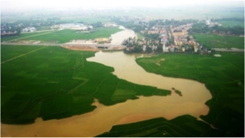
 
 	Figure 1: Red River, Vietnam

Small Water Body Mapping Application Input
++++++++++++++++++++++++++++++++++++++++++

As input for the SWBM application, there is EO data available of multiple satellite sensors with varying spatial, temporal and spectral resolution. For the SWBM application there is currently data available from Sentinel -1 GRD, Sentinel-2 and Envisat ASA IMP 1P. 

**Sentinel-1** High Spatial , High Temporal Resolution

The resolution of Sentinel-1 in ground is approximately 20x5m. TRE ALTAMIRAs SWBM application uses Ground Range Detected (GRD) images for processing. These images are already pre-processed; they are corrected and prepared in ground range projection. Once projected with a Digital Elevation Model (DEM) the images can achieve 10x10 meters, as some data is interpolated below the initial resolution. To ease the processing and the volume of data storage, the spatial resolution of the SWBM output products is 20x20 meters.
Sentinel-1’s Synthetic Aperture Radar (SAR)-sensor works in the microwave spectrum, specifically in C-band. C band has a wavelength of approximately 5.6 cm and the frequency of the satellites is around 5.405 Ghz. For more info about Sentinel-1, please visit https://sentinel.esa.int/web/sentinel/user-guides/sentinel-1-sar/resolutions. The revisit frequency of Sentinel-1 is, due to ascending and descending and overlap images, approximately 1-3 days depending on the latitude. As such Sentinel-1 has a high temporal resolution.

**ENVISAT (ASAR)**	High Spatial , Monthly Temporal Resolution

The specifications of ENVISAT satellite and its data products are comparable to those of Sentinel-1 as it also uses the Advanced Synthetic Aperture Radar (ASAR)-sensor. ENVISATs sensor therefore works in the microwave spectrum just like Sentinel-1 SAR-sensor. The SWBM app product output using ENVISAT-data products is also 20x20 meters. For more specification of ENVISAT ASAR please visit http://envisat.esa.int/handbooks/asar/toc.html.   
The main difference with Sentinel-1 is the considerably lower temporal resolution of ENVISAT with a revisit frequency of approximately 35 days. As such ENVISAT has an average temporal resolution. In the context of HTEP, ENVISAT data products can be used for historical analysis of the evolution of (non-)permanent small water bodies. HTEP ENVISAT data is currently only available from 2009 until 2011.

**Sentinel-2**	 High Spatial, Weekly Temporal Resolution

Sentinel-2 works not in the microwave spectrum but in the multi-spectrum: the visible spectrum and infrared spectrum. Each band of Sentinel-2 has its own wavelength and frequency, hence the resolution is dependent on the used band also. Some bands have a resolution of 10x10m whereas others have a resolution of 20x20m. The SWBM application uses 20x20m resolution optical images to refine the water masks obtained from Sentinel-1 and ENVISAT SAR data products. Sentinel-2 has a monthly revisit of approximately five times, meaning a weekly temporal resolution. For more information about Sentinel-2 please visit https://sentinel.esa.int/web/sentinel/user-guides/sentinel-2-msi.

Influence of obstructions such as clouds
****************************************

As mentioned in Section 2.6.1.1.1, Sentinel-1 and ENVISAT make use of sensors working in the microwave spectrum. Therefore obstructions such as clouds do not affect the SAR images. SAR is optimal for instance in areas with huge cloud coverage (floods in hurricane storms and in wet season in several areas with large amount of rainfall) where the optical sensors are very limited. As such there is no need to take into account obstructions such as cloud coverage when you pick data products for analysis from either Sentinel-1 or ENVISAT. 
However, Sentinel-2 data is used to refine the water masks using optical sensors operating in the multispectrum. As those sensors use the backscattering of light within the visible spectrum, wavelengths cannot properly penetrate obstructions such as clouds and haze, meaning those kind of obstructions sometimes result in difficult measuring conditions. The quality of refinement is therefore dependent on the cloud coverage in the Sentinel-2 images. 

Small Water Body Mapping Application Output
++++++++++++++++++++++++++++++++++++++++++

As the name of the application indicates, the output of this application is a water mask mapping the (non-)permanent water bodies in the analysed area. The output of this application can also be used as input for others applications on HTEP, such as the Water Level application discussed in :doc:`Quick Start Manual 7 <qsm7>`. Figure 2 shows the water mask of the river between Viet Tri and Hanoi, in the Red River basin. In this tutorial those results will be reproduced.
 
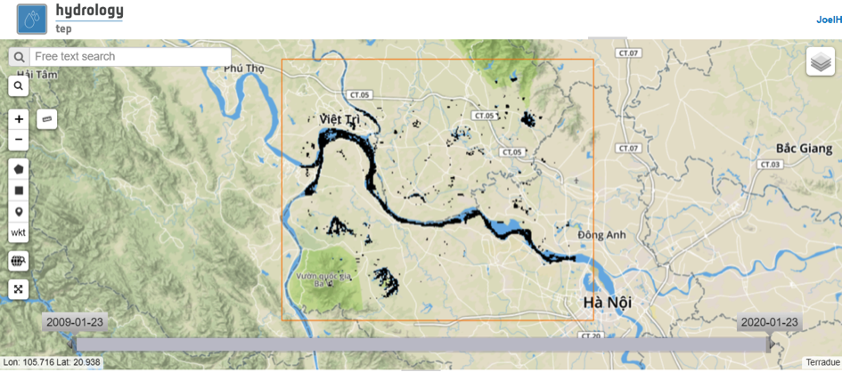
 
 	Figure 2: Water Mask from SWBM app of Red River section between Viet Tri and Hanoi

Tutorial: Small Water Body Mapping in My Area of Interest
=========================================================

This chapter contains a hands-on tutorial how to work with TRE ALTAMIRAs SWBM application on HTEP. The tutorial shows and explains step-by-step the different features of HTEP and the actions to be taken in order to create the small water bodies map of Figure 2. For this tutorial, the area of interest is the part of the Red River between Viet Tri and Hanoi, in the Red River basin. 

Accessing the Small Water Body Thematic Application
~~~~~~~~~~~~~~~~~~~~~~~~~~~~~~~~~~~~~~~~~~~~~~~~~~~

1.	Enter the HTEP Community Portal and Sign in with your HTEP community user account. There is no preferred internet browser. However, for this specific tutorial, Google Chrome is used as the internet browser. 

You do not have an account yet? Then first register on the platform. To register at the platform, it is advised to follow the steps in the Quick Start Manual How to become a user of HTEP, which can be found under the Quick Start-tab in the menu of the HTEP Community Portal. 

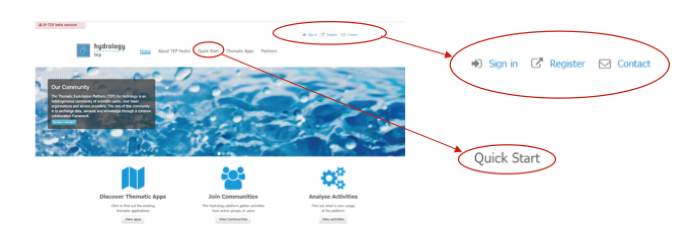
 
 	Figure 3: Step 1 – HTEP Community Portal

2.	Access the Thematic Applications. Open the list of existing thematic applications by clicking on View Apps below to Discover Thematic Apps-icon.

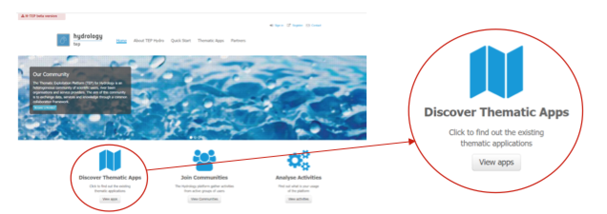
 
 	Figure 4: Step 2 - Access the thematic applications

3.	A list of available Thematic Applications is shown. For this tutorial the Small Water Bodies for Red River application is used. The application can be opened by clicking on the Open App button on the right side. A pop-up containing information about this specific application and a list of some application-keywords appears when clicking on the title of the app. The SWBM application can also be accessed directly using the URL https://hydrology-tep.eo.esa.int/geobrowser/?id=smallwaterbody-redriver. 
  
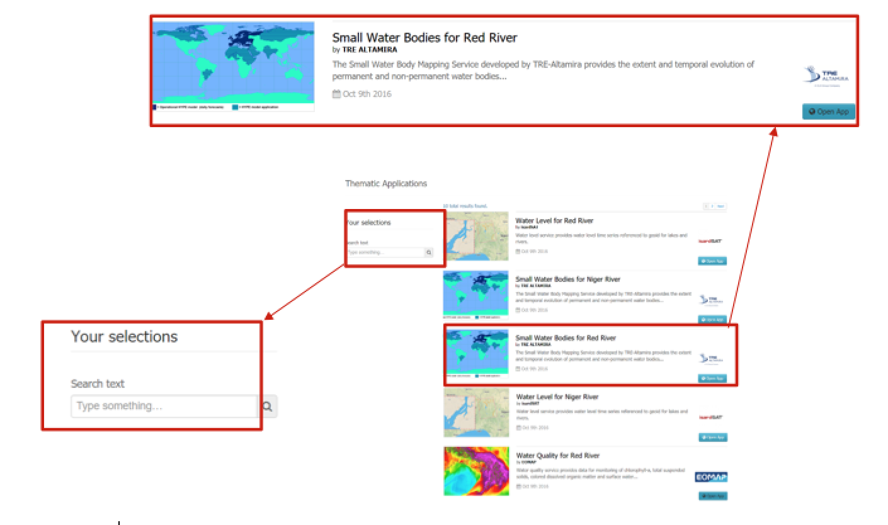
 
 	Figure 5: Step 3 and 4 - Available applications and your selections

4.	Filter your application of interest by using the Your selections column on the left side of the Thematic Applications page: Search text allows you to use keywords to find a corresponding thematic application. Currently the Your selections-feature is unnecessary, as there is only a limited number of thematic applications available. However, you might need this feature to find your application of interest once the number of available applications has significantly increased.

Search Your Data of Interest for Your Area of Interest
~~~~~~~~~~~~~~~~~~~~~~~~~~~~~~~~~~~~~~~~~~~~~~~~~~~~~~

Once the SWBM application has been accessed, a new tab opens called the Geobrowser. This part of the tutorial will teach you to work with the various features and functions available within the Geobrowser. Currently the default map is of Northern Vietnam and Southern China: the Red River basin. The default map shown upon opening the SWBM app may change in the future. 

1.	You can zoom in and zoom out by clicking on the + and – icons on the left side of the Geobrowser, encircled in red. The map can be shifted to any desired area by clicking on the map and dragging your mouse. For this tutorial the focus is kept on default; the Red River area in Northern Vietnam and Southern China. 
 
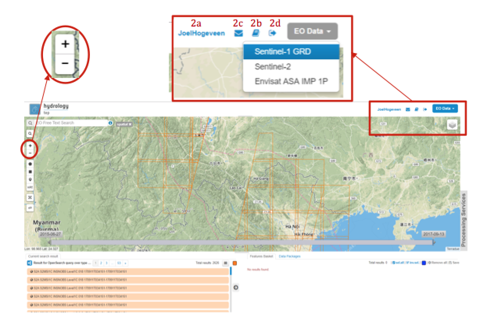
 
 	Figure 6: Step 1,2 and 3 - The water quality application Geobrowser

2.	If you are correctly logged onto the HTEP platform, on the top-right of the Geobrowser your username should be displayed (2a). If you need any further explanation about the HTEP-platform and its features, a Help Guide can be easily accessed by clicking on the book-icon next to the email-icon (2b). If this is insufficient, you can ask for help through the contact form (2c). If you would like to sign out, this can also be done within the Geobrowser by the exit-icon (2d).

3.	You can select which satellite data source you would like to use for your research on the top-right of the Geobrowser. Selecting EO Data imposes a dropdown menu showing all available remotely sensed EO data sources for this application. 

As discussed in Section 2.6.1.1.1, the SWBM application has currently data available from Sentinel-1, Envisat, and Sentinel-2. The EO data to be selected depends on your requirements and research purposes, as each satellite has its own specifications suiting different requirements. Sentinel-1 and Envisat have relatively similar specifications and are the main input parameters for analysis: Sentinel-1 for monitoring present water bodies and Envisat for historical analysis. Sentinel-2 products are optical data products used to refine the analysis of the main input products.

For this tutorial, Sentinel-1 data is selected. 

4.	Once EO data from a certain satellite is selected, you can search for specific data images (data products) within the available database from the selected satellite. The options to filter your data products of interest out of the complete database are listed below. The actions can also be combined for an even more specific data search. 

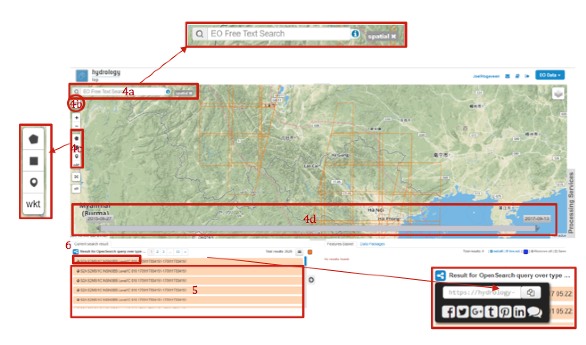
 
 	Figure 7: Step 4,5 - Search for data products in the Geobrowser

➢	Search Field (4a): On the top-left of the Geobrowser, you see a search field. In this field, you can do a text search for specific EO data products within the data source chosen in step 3. For now this field is left blank.

➢	Clicking on the magnifying glass (4b) below the search field, opens the Search Panel of Figure 8: a panel containing multiple additional filters to find your desired data product. For example the productType and a time range filter. Show Other Parameters opens another extensive list of filters, amongst others cloud- and land cover filters and geometry filters for a spatial search. For now also leave the Search Panel untouched, so at default settings. 

.. NOTE:: 
	The Search Field cannot be used to search for geographic places: this feature in non-existent in the Geobrowser. 

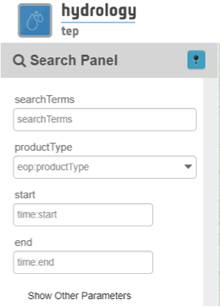
 
 	Figure 8: Data products search panel

➢	Although the Search Panel already provides you the option for a spatial filter based search, you can also apply a spatial search through the tools of 4c. A polygon, rectangle, marker and well-known text (WKT) code can be used to define your area of interest. For this tutorial a spatial filter is applied using a WKT-code. Click on the WKT button: the pop-up of Figure 9 appears.
 
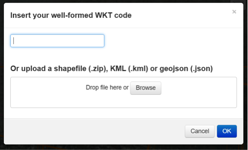
 
 	Figure 9: Step 4c - Apply a spatial filter using WKT-code or Shapefile

As you can see a spatial filter can be applied using a WKT-code, but also by simply dragging and dropping a Shapefile or uploading a Shapefile from your computer. For now a WKT-text is used. Copy and paste the following code in the top field: POLYGON((105.437 21.365,105.33 21.326,105.314 21.224,105.407 21.172,105.531 21.115,105.756 21.067,105.807 21.182,105.646 21.238,105.529 21.229,105.437 21.365)) and click on OK. This WKT code is the area of interest, the part of the Red River between Viet Tri and Hanoi: the river should now be boxed by a pink dashed line. 

➢	Now also a time filter is applied. The time filter can be applied not only through the Search Panel, but also using the tool of 4d indicated in Figure 7. The slider at the bottom is a time filter that can set by sliding the begin and end date to the desired time range. For now drag the left side of the time filter to 2017-03-01 and the right side of the time filter to 2017-03-31. Alternatively use the Search Panel.

5.	The current search results, based on the selected satellite and the applied filters, are displayed on the bottom left of the Geobrowser. The data products in this box are also displayed on the map of the Geobrowser by means of orange rectangles. There should be 5 data products found for the search of this tutorial.

6.	If you would like to share your search results, click on the blue icon above the search results. The link can be copied and pasted or be posted through social media (i.e. Facebook and Twitter). Feel free to share if you like.

Select Your Data of Interest for Your Area of Interest
~~~~~~~~~~~~~~~~~~~~~~~~~~~~~~~~~~~~~~~~~~~~~~~~~~~~~~

Figure 10 shows the search results from Section 2.6.2.2. Now the data products of interested will be selected and saved in a Data Package.

1.	By clicking on an EO data product in the current search results box, the selected product is highlighted blue. In the map the spatial area covered by the selected product is boxed by a bold white line and a pop-up appears. In the pop-up information about this specific data product is provided, such as the product type, swath, orbit and time of capturing.

2.	In the pop-up box there is also the option to select Download or Related Search. The download can be performed through the Download (application/octet) (for Sentinel-1 this is through the Copernicus SciHub database) or directly through the Data Gateway of the HTEP platform. The related search offers you the option to search for data products with a similar time range, spatial coverage or a combination thereof as the currently selected data product. Feel free to download or do another search, but for this tutorial it is not necessary. 

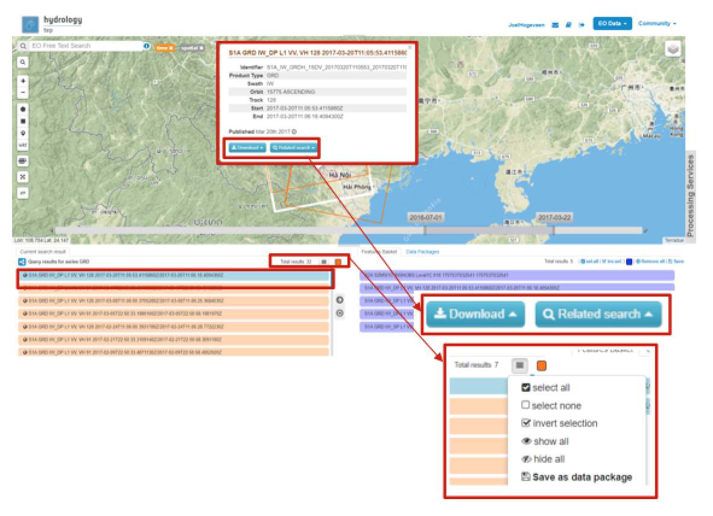
 
 	Figure 10: Step 1-3 - Select your data product of interest

3.	To  easily  select/deselect  (multiple)  products  or show/hide (multiple)  products on the map of the Geobrowser,  use  the  icon  next  to  the   orange square.

4.	The data products of interest for your research can be selected and transferred to the features basket simply using drag and drop as illustrated in Figure 11. 
 
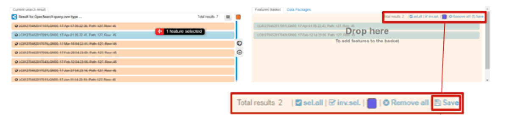
 
 	Figure 11: Step 4-6 - Drag and drop data products from search results to features basket

For this tutorial, select the following three products from the current search results and transfer them to the features basket: S1A GRD IW_DP L1 VV, VH 128 2017-03-20T11:05:53.4115860 (20 March 2017), S1A GRD IW_DP L1 VV, VH 91 2017-03-17T22:50:33.49198502 (17 March 2017) and S1A GRD IW_DP L1 VV, VH 128 2017-03-08T11:06:00.3705280 (8 March 2017).
Change the satellite data source from Sentinel-1 to Sentinel-2 to see if there are usable optical data products for result refinement. Three data product appear: click on them for additional information. As you can see, all data products have a cloud coverage of >98%. As such refinement using Sentinel-2 data is impossible for this exercise. 

5.	The products in the features basket can be easily selected/deselected and/or removed using the options on the top-right of the features basket. 

6.	All data products dropped in the features basket, can together be saved as a single Data Package using the Save button on the top-right of the features basket box. The pop-up of Figure 12 appears and a name can be assigned to the Data Package. Name your data package SWB_VietTri_Hanoi_March17_username (replace username by your username). Click on Save to Save the Data Package: a message should appear stating a successful save.

The advantage of a Data Package is that you can easily load your data products of interest at any arbitrary time and you can also easily share it with other hydrologists. 
 
.. figure:: includes/qsm6-f12.png
	:align: center
	:width: 80%
	:figclass: img-container-border	
 
 	Figure 12: Step 6 - Save your data products in a Data Package

7.	Your data package created in step 6, can be found in the Data Packages box. Access the Data Packages box using the Data Packages tab, located next to the Features Basket tab.
  
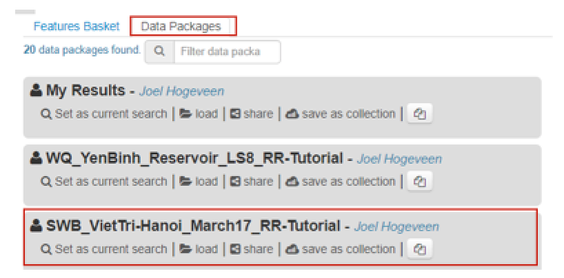
 
 	Figure 13: Step 7-9 - Overview of available data packages

8.	You see a list of many Data Packages published by other users. Find your own Data Package, which has the name you gave it in Step 6. The human-icon in front of the Data Package name indicates this Data Package is created by you and only visible for you.

9.	One of the options is to share your Data Package with all other HTEP users or with your community. To do so, click on share. A pop-up will appear as shown in Figure 14.
 
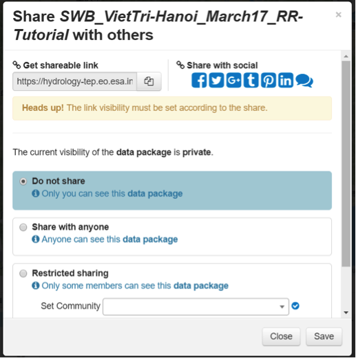
 
 	Figure 14: Step 9 - Choose the visibility of your data package

The available options are:

	- **Do not share:** Default setting, meaning your data package is only visible for yourself.
	- **Share with anyone:** Share your data package with all other HTEP users.
	- **Restricted sharing:** Share your data package with a limited number of users, for example only a specific user(s) or with users from the same community.

For now, leave your data package at default settings (Do not share) and Close the pop-up. In the list of public Data Packages there should be a Data Package called SWB_VietTri-Hanoi_March17_RR-Tutorial. This Data Package was created and published for the purpose of this tutorial. Please click on load: the products from this Data Package are loaded. It contains the same products as your own data package, and two additional products: A Sentinel-2 product and another Sentinel-1 product from 2016. 

10.	Additional features to manage Geobrowser map visualisation: On the top-right of the Geobrowser the lay-out manager-icon, indicated by the red rectangle in Figure 15, can be selected: a list of options will appear to manage the Geobrowser map visualisation. The background of the map can be changed from default to for example Google Maps or Natural Earth. In the dropdown menu it can also be defined which products should be shown on the map: for instance the products from the related search, the products from the features basket or the data results after processing, which will be discussed in Section 2.6.2.4. Feel free to play with the visualisation of the map.

           	                      
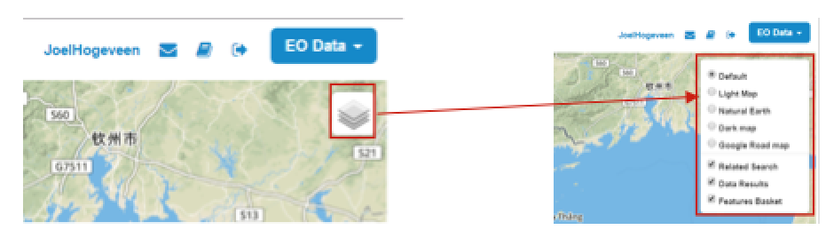
 
 	Figure 15: Step 10 - Change the visualisation of the Geobrowser map

Processing Your Data Using the Small Water Bodies Mapping service
~~~~~~~~~~~~~~~~~~~~~~~~~~~~~~~~~~~~~~~~~~~~~~~~~~~~~~~~~~~~~~~~~

Section 2.6.2.2 and 2.6.2.3 explained how to search for and select your data of interest within the Geobrowser. Having the relevant data selected and saved, it is now time to process this data to obtain the desired product output.

1.	The processing services can be accessed from within the Geobrowser, but they are initially hidden. Open the available processing services by clicking on the processing services tab. 

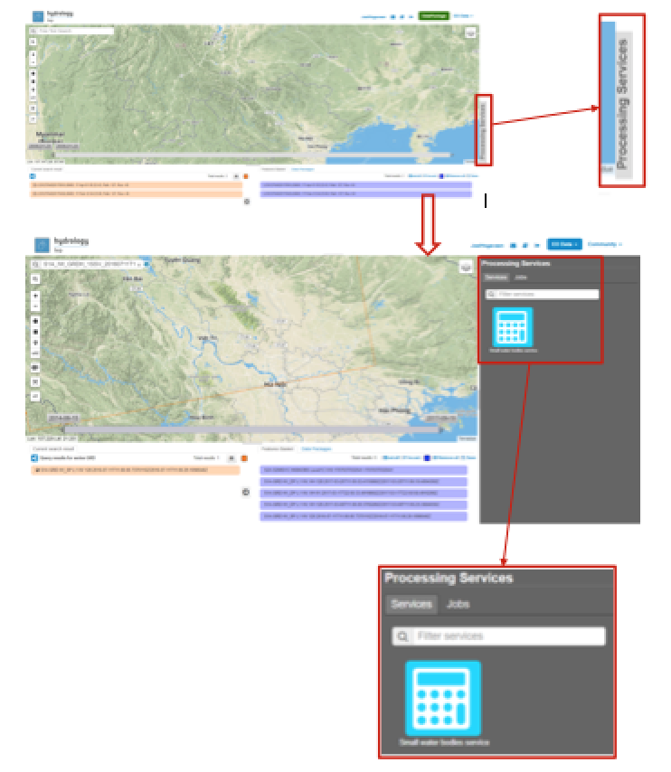
 
 	Figure 16: Step 1, 2 and 3 - Access processing services   

2.	On top of the processing services, three options are displayed: Services, Jobs and a Search Field. 

➢	Services: This tab yields a list of available processing services (the different models and algorithms within the application). Currently only the Small water bodies processing service is available, but this number will increase in the future.
 
➢	Search Field: Once the number of available processing services has increased, the Search Field can be used to filter only those processing services of interest.

➢	Jobs: This tab lists all existing jobs. The jobs shown are the jobs you have created yourself  or the jobs who have been published by other HTEP users. 

3.	For now, click on the process service Small water bodies service to access the Small Water Body Mapping processing service. See Figure 17.

4.	To process data and create output, a Job needs to be created. A job can be created by filling in all the fields as shown in Figure 17: 

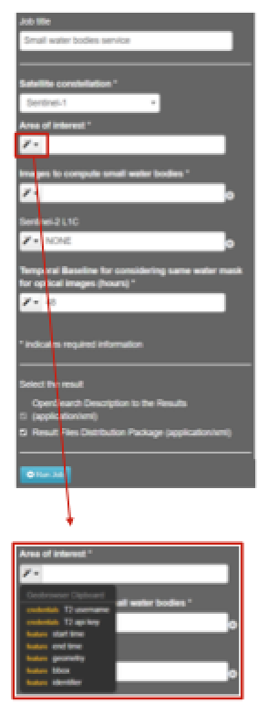
 
 	Figure 17: Step 3,5 - SWBM processing service

➢	Job title: Give your Job a title, for instance SWB_VietTri-Hanoi_March17_username. Any other name with arbitrary length and symbols is also allowed.

➢	Satellite constellation: Here you define from which satellite you are going to analyse products. For this tutorial this is Sentinel-1.

➢	Area of interest: Define your area of interest. Click on the arrow and a dropdown menu appears.  Pick bbox (bounding box) - geometry to define the area used as a spatial filter in Step 4 of Section 2.6.2.1 as the area of interest. The WKT-code will appear in the field.

➢	Images to compute small water bodies: This are the images that will be used to analyse the small water bodies. Drag all Sentinel-1 products from your features basket to this input field.

➢	Sentinel-2 L1C: This is the input field in case you wish to use Sentinel-2 products for refinement of the results. The field can be kept at NONE if no refinement is needed, but for this tutorial please drag the Sentinel-2 product from the features basket to this input field.
 
➢	Temporal baseline: In this field it should be indicated what maximum time difference is allowed between the input Sentinel-1/ENVISAT data products and the Sentinel-2 data products. If the differences in water bodies between both data products are too large, it is not useful to use one product to refine the results of another product. A suitable baseline depends on the area and the event. The baseline is by default 48 hours, but for this tutorial it is set to 300. 

➢	If desired, you can share your processing service on social media with the Share-icon above Job Title.

5.	Click on the Run Job button to run the job. 

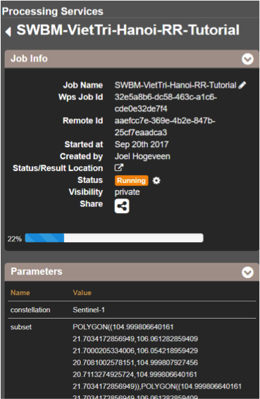
 	
 	Figure 18: Step 6 - Job progress and job info

6.	Now the job is running, your data is analysed using HTEPs cloud services. During the processing of your data, information about your job is displayed as shown in Figure 18. Job Info provides info about the job, such as the name of the job, its identifiers, the date of creation and the user who created the job. Besides a progress bar shows you the progress of the analysis and under parameters you see the input and output parameters used for this specific job. 

Visualising and Sharing of Job Results
~~~~~~~~~~~~~~~~~~~~~~~~~~~~~~~~~~~~~~

The previous section showed how to process the data products obtained from Section 2.6.2.2 and 2.6.2.3. Once the process is finished, which may take a considerable amount of time, the results can be visualized and possibly shared with others users and/or your community.

1.	Once the processor has finished the job, the Status of the job will change from Running to Success as shown in Figure 19.

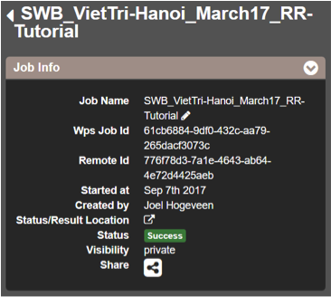
 
 	Figure 19: Step 1 - Processor after a succesfull job

2.	If a problem occurred during the processing of your job, or if it was performed using the wrong parameters then click Resubmit Job to run the job again. Adaptions to your parameters can be made.

3.	But if your job was processed correct and successful, simply click on the Show Results button to show the results of your job.

4.	The results of your job are loaded in what previously was the current search result box, see Figure 21. To know if you this box contains EO satellite data products or job results, take a look on the top-right of the Geobrowser to check if you are in the Products tab or EO Data tab.

5.	The job results are not just loaded in the current search results box, but also in the Geobrowser. You can visualize each parameter individually in the Geobrowser by selecting the option show only this feature. 

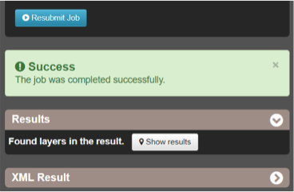
 
 	Figure 20: Step 2,3 - Job progress and job info

6.	For each analysed image there are three output products in tiff format, which can be visualized in the Geobrowser. Furthermore the results show a quality_control.zip file. The SWBM application allows you to check the intermediate results during the analysis, in order to analyse the quality and reliability of the end product. If you wish to do a quality control, download this zipfile and follow the SWBM Quality Control Manual incorporated in the HTEP User Manual: http://hydrology-tep.github.io/documentation/apps/swbm.html.

7.	The resolution of the job results within the Geobrowser is rather low and may impose the false assumption of unreliable results. Therefore, click on your data product of interest in the result box and a pop-up will appear as shown in Figure 21. Here you can Download the result in different formats. 
 
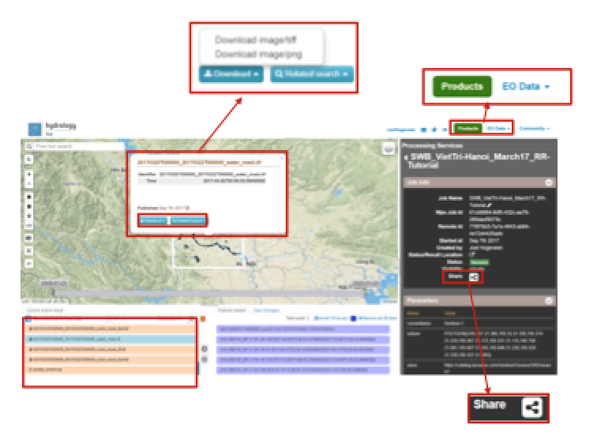
 
 	Figure 21: Step 4-8 - Visualisation of Job Results

8.	Through the Share-button in the processor tab, you can share your results with other users, your community, or simply with all HTEP users.

9.	To find your previously generated job results, or to find job results shared by others users, go to the Jobs-tab in the processing service as illustrated in Figure 22.

10.	Click on the Show thematic jobs-field next to the Filter Jobs Search Field: here you can choose which jobs you wish to see: only the thematic jobs, all jobs, only your own created jobs or only public jobs. Once you found your job of interest, click on the name of the job and access the results as explained in steps 3-7. You will see there is a thematic job available that shows the results from this Quick Start Manual: SWB_VietTri-Hanoi_March17-RR-Tutorial.
 
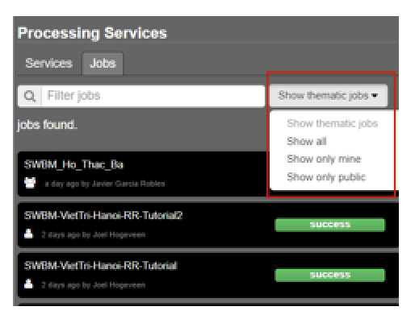
 
 	Figure 22: Step 10 - List of published Jobs
	

