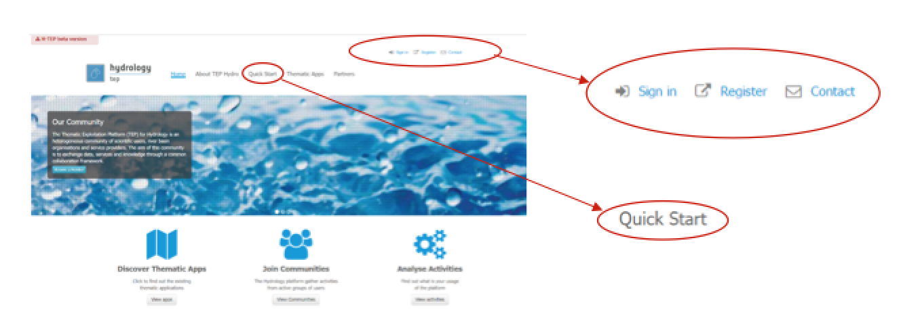
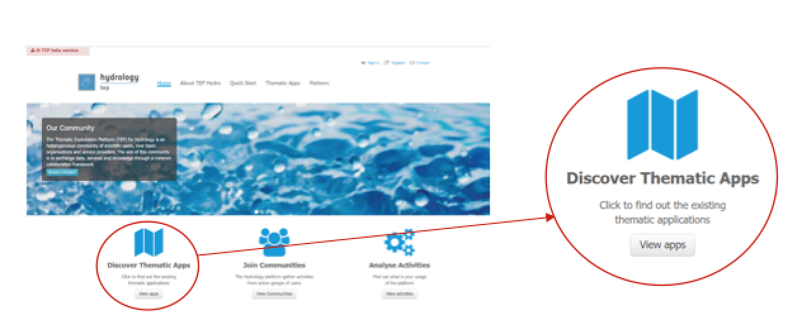
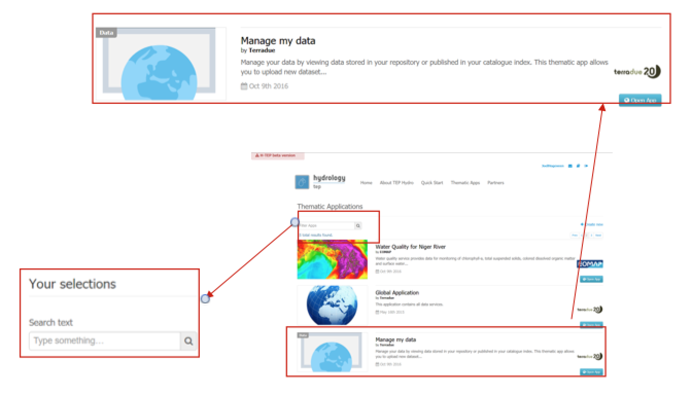
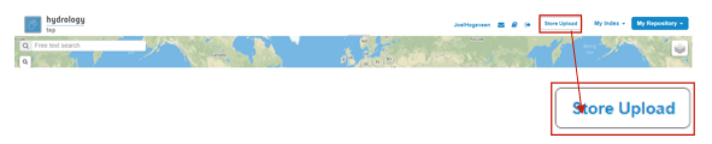
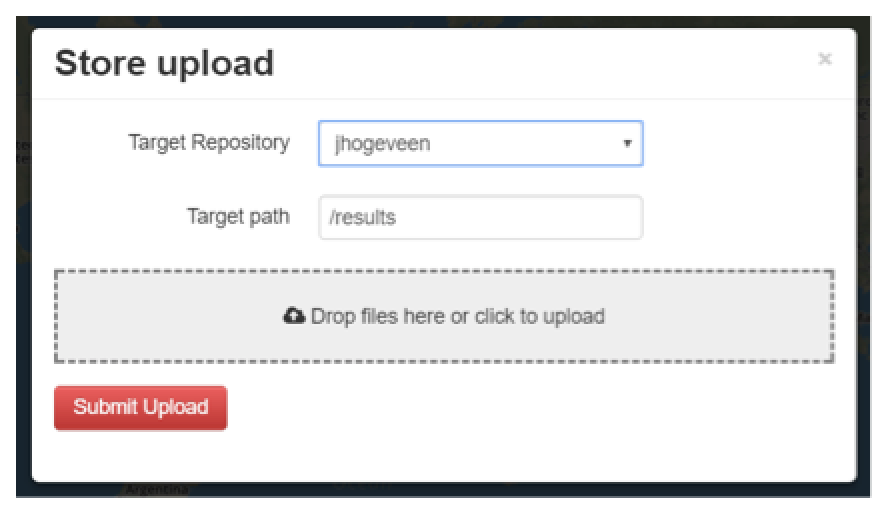
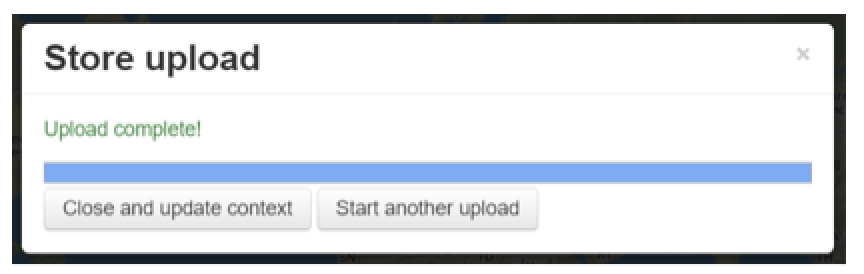
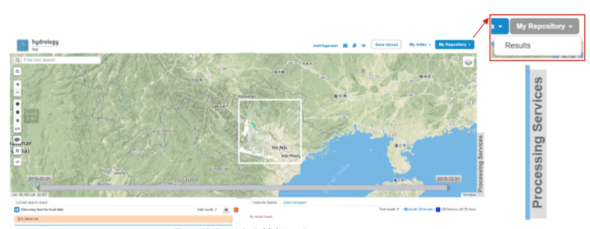
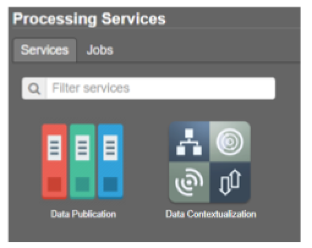
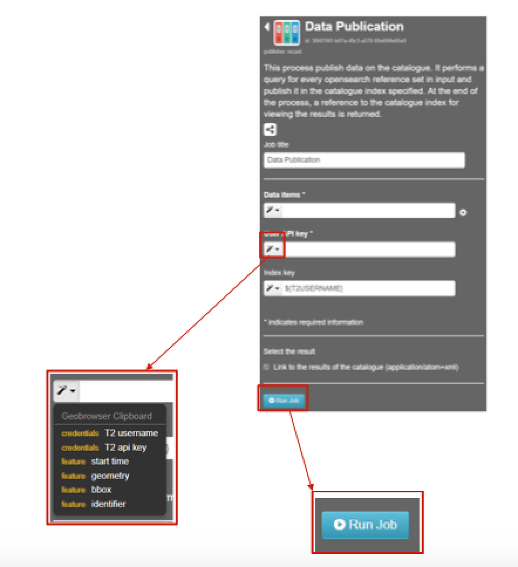
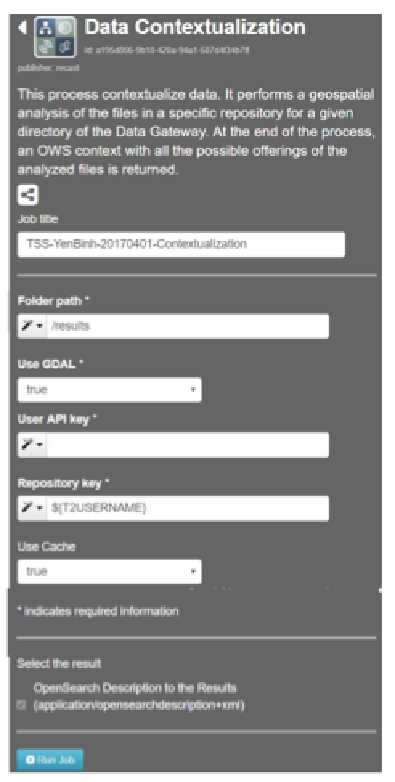

.. _QSM9:

Upload Your Own (In-Situ) Data
------------------------------

This guideline contains an exercise to show you the necessary steps to be taken to upload your own (in-situ) data to the Hydrology Thematic Exploitation Platform (HTEP). 

Tutorial: Upload Your Own (In-Situ) Data
========================================

For this exercise, in-situ data will be uploaded. As an example for this process, a GeoTiff containing Total Suspended Solids data of the Yen Binh water reservoir at 2017-04-01, created in the Water Quality application tutorial (see Quick Start Manual 5), is used. You can get this exercise-file yourself in one of the following ways: 

	-	Follow the steps of :doc:`Quick Start Manual 5 <qsm5>` to create this file yourself and download the results.
	-	By accessing and downloading the results of job WQ_YenBinh_Reservoir_LS8_Spring2017 (published in the Red River community).

To upload data you need to have an account at Terradue, where you have to create an API-key, a repository (to store your data upload), and a catalogue. This account is automatically created according to your user level (visitors users does not have an account created).

Access the Manage my Data Application
~~~~~~~~~~~~~~~~~~~~~~~~~~~~~~~~~~~~~

1. Enter the HTEP Community Portal and Sign in with your HTEP community user account. There is no preferred internet browser. However, for this specific tutorial, Google Chrome is used as the internet browser. 

You do not have an account yet? Then first register on the platform. To register at the platform, it is advised to follow the steps in the Quick Start Manual How to become a user of HTEP, which can be found under the Quick Start-tab in the menu of the HTEP Community Portal. 

	Figure 1: Step 1 – HTEP Community Portal

2. Access the Thematic Applications. Open the list of existing thematic applications by clicking on View Apps below to Discover Thematic Apps-icon.

    
    Figure 2: Step 2 - Access the thematic applications

3. A list of available Thematic Applications is shown. For this tutorial the Manage my Data application is required. The application can be opened by clicking on the Open App button on the right side. A pop-up containing information about this specific application and a list of some application-keywords appears when clicking on the title of the app. The Manage my Data application can also be accessed directly using the URL https://hydrology-tep.eo.esa.int/geobrowser/?id=managemydata. 

	Figure 3: Step 3 and 4 - Available applications and your selections

4. Filter your application of interest by using the Your selections column on the left side of the Thematic Applications page: Search text allows you to use keywords to find a corresponding thematic application. Currently the Your selections-feature is unnecessary, as there is only a limited number of thematic applications available. However, you might need this feature to find your application of interest once the number of available applications has significantly increased.

Upload Data to Your Repository
~~~~~~~~~~~~~~~~~~~~~~~~~~~~~~

Once the Manage my Data application has been accessed, a new tab opens called the Geobrowser. In the Geobrowser you can upload your (in-situ) data to your newly created repository.

1. Click on the Store Upload button on the top-right of the Geobrowser. 

	 
2. The Store upload-screen of Figure 5 appears. Here you define:

	-	**Target Repository:** The repository you wish to store your (in-situ) data. This is by default your own username. Leave it as default for this exercise.
	-	**Target path:** Choose a path (a folder) in your repository where you would like to store your (in-situ) data. By default this is /results, an automatically created folder. Leave it as default for this exercise. Change this target path only if you have multiple folders in your storage.
	-	**Drop files:** Drag and drop, or click and browse for your (in-situ) data to be uploaded. Any file extension (.csv, .mat, .xlsx, .png etc.) is possible. For this exercise the WQ GeoTiff is selected that contains data about the TSS in the Yen Binh reservoir.

	
	Figure 5: Step 2,3 - Store Upload Input Data

3. Click on Submit Upload. A screen with the process of your upload is displayed.

4. After a successful upload, you get the message Upload complete! Click on close and update context or start another upload if you would like to upload more data to your repository.

 
	Figure 6: Step 4 - Successful Data Upload

Publish Your (In-Situ) Data in The Catalogue
~~~~~~~~~~~~~~~~~~~~~~~~~~~~~~~~~~~~~~~~~~~~

1. Select My Repository in the top-right of the Geobrowser and select the folder you have stored you data in Section 2.9.1.2 to access the products you have uploaded. For now the only folder is Results.

 
	Figure 7: Step 1-3 - Publish Your Data

2. Open the processing services tab.

 
	Figure 8: Step 4 - Data Publication Processing Service

3. On top of the processing services, three options are displayed: Services, Jobs and a Search Field as shown in Figure 13.

	-	Services: This tab yields a list of available processing services. For this special application, this are the data publication service and the data contextualization service.

	-	Search Field: Once the number of available processing services has increased, the Search Field can be used to filter only those processing services of interest.

	-	Jobs: This tab lists all data publications. The jobs shown are the jobs you have created yourself  or the jobs who have been published by other HTEP users. 

4. Click on the processing service Data Publication. Using this service you can put the data from your folder to a Catalogue. A catalogue is from where your data can be searched for. So if you plan to share uploaded data with other HTEP users, make sure you publish your data to a catalogue accessible to your target users. 

 
	Figure 9: Step 5,6 - Data Publication Processor

5. Within the Data Publication processing service, fill in the following fields:

	-	Job Title: Give your data publication job a title. For instance TSS-YenBinh-20170401.
	-	Data Items: Drag and drop the to-be-published files from your repository to this field.
	-	User API key: Click on the dropdown menu and select T2 api key.
	-	Index key: Select where in the catalogue you would like to publish your data. Leave it as default if you want to publish your data only to your private catalogue. For this exercise the field is left as default.

6. Click on Run Job. After a successful job, information about the job is displayed. Click on Show Results to find your (in-situ) data in the current search results box.   

Contextualize Your (In-Situ) Data
~~~~~~~~~~~~~~~~~~~~~~~~~~~~~~~~~

This process contextualizes data. It performs a geospatial analysis of the files in a specific repository for a given directory of the Data Gateway. At the end of the process, an Open Warehouse (OWS) context with all the possible offerings of the analysed files is returned.
1. Go back to the services tab in the processing services of the Manage my Data application (see Figure 14). Figure 15 appears.

 
	Figure 10: Step 1-3 - Data Contextualization Processor

2. Fill in the following fields:

	-	Job Title: Give your job a title, for instance TSS-YenBinh-20170401-Contextualization
	-	Folder path: Choose the data you would like to contextualize by defining its path (e.g. /results/example-data). For this exercise the field can be left at /results as there is currently only one file in the results folder.
	-	Use GDAL: Decide if you would like to analyse your data using the GDAL Library. This is the case for raster and vector publication. For this exercise choose true as the used contains raster data.
	-	Use API key: Provide your API key using the dropdown menu left to the input field.
	-	Repository key: Usually this is the Terradue username. Provide your username using the dropdown menu left to the input field.
	-	Use cache: Decide whether you would like to cache your contextualized data file for easy and quick access. For this exercise the field as left as default: true.

3. Click on Rub Job

4. After a successful job, the status of the job changes from running to success. An overview of the job information and used parameters is given. Your data should now be correctly contextualized and be displayed correctly in the Geobrowser map.

